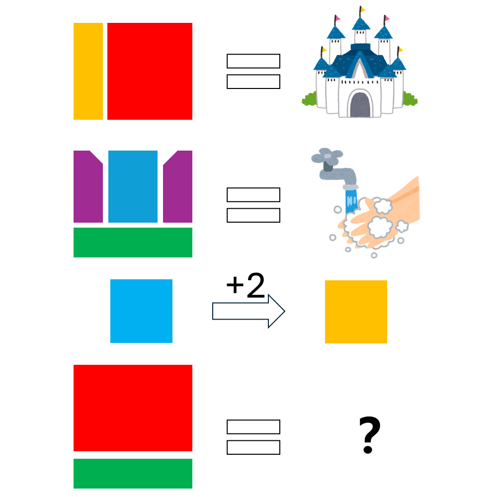

# 千字谜子题 201

## 题面

## 答案

`盛`

## 解析

第一行是城堡的城，第二行是盥洗的盥。蓝色是水，橙色是土，按金木水火土，水的后两位就是土。红色是成，绿色是皿，故答案为盛。

## 本地附件

- [3a095dd6b3cc483cbe1334314a5cd2a6.webp](../../../assets/static.cipherpuzzles.com/static/images/3a095dd6b3cc483cbe1334314a5cd2a6.webp)

来源：[https://ccbc16.cipherpuzzles.com/data/c16-qian-puzzle.json#cid=201](https://ccbc16.cipherpuzzles.com/data/c16-qian-puzzle.json#cid=201)
