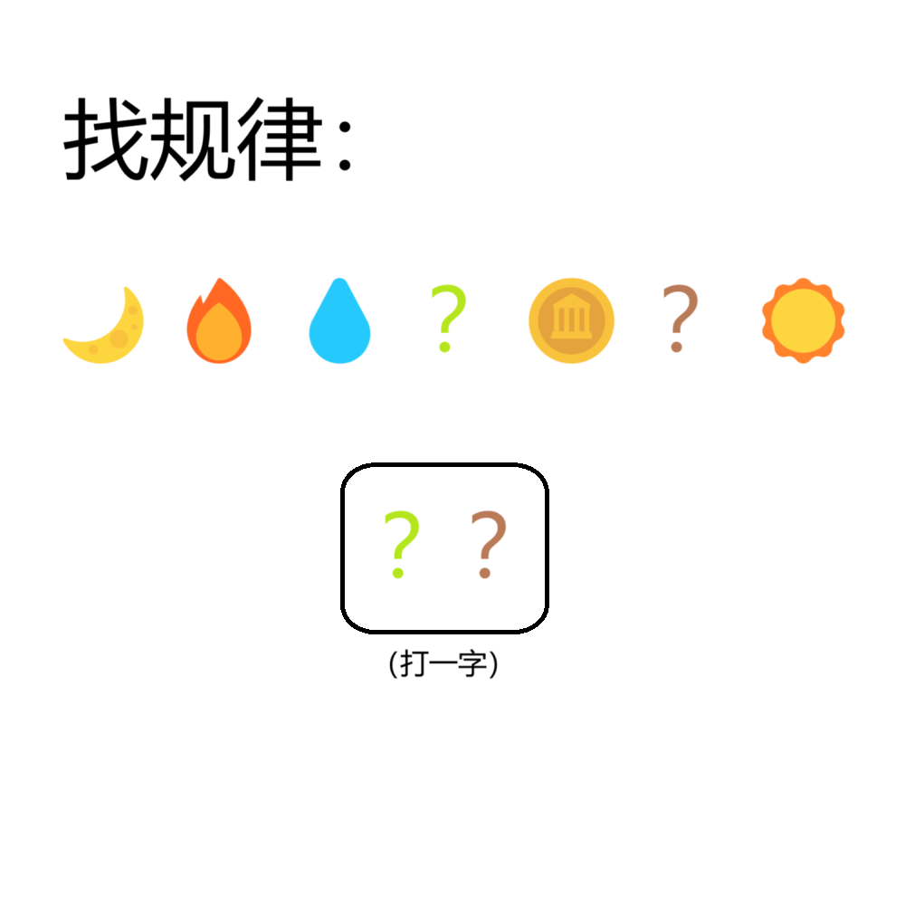

# 千字谜子题 204

## 题面

## 答案

`杜`

## 解析

显然emoji代表着从月曜日开始的一周七天，两个颜色的问号处分别为木（曜日）和土（曜日），合在一起即为谜底“杜”。

## 本地附件

- [24000592fb51464e9f7cbc0b37505562.webp](../../../assets/static.cipherpuzzles.com/static/images/24000592fb51464e9f7cbc0b37505562.webp)

来源：[https://ccbc16.cipherpuzzles.com/data/c16-qian-puzzle.json#cid=204](https://ccbc16.cipherpuzzles.com/data/c16-qian-puzzle.json#cid=204)
