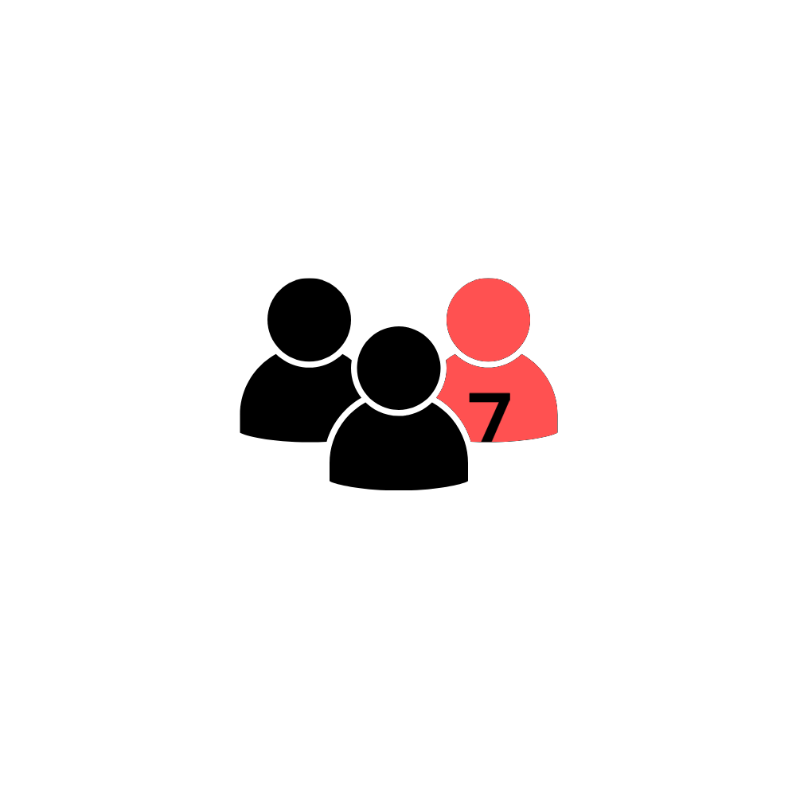

# 千字谜子题 205

## 题面

## 答案

`佑`

## 解析

三个人，红色提示右边，人提示人字旁，7提示笔画。

## 本地附件

- [2e570acbaae54477a9044dee64e0e2e6.webp](../../../assets/static.cipherpuzzles.com/static/images/2e570acbaae54477a9044dee64e0e2e6.webp)

来源：[https://ccbc16.cipherpuzzles.com/data/c16-qian-puzzle.json#cid=205](https://ccbc16.cipherpuzzles.com/data/c16-qian-puzzle.json#cid=205)
