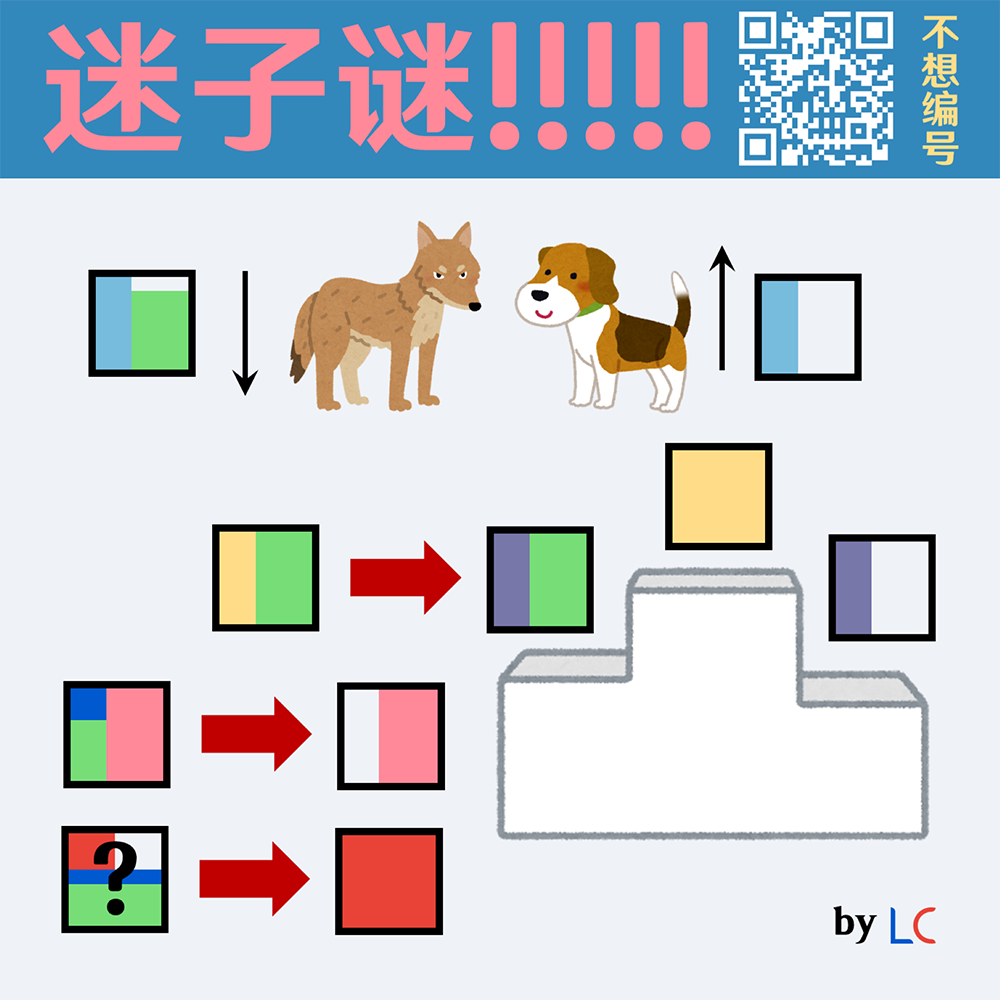

# 千字谜子题 208

## 题面

## 答案

`餐`

## 解析

“尾巴下垂的是狼，上竖是狗。”可以知道上面两个框是“狼”和“狗”，结合颁奖台可以知道右侧三个框是“金”“银”“铜”，由此知道第一个箭头是“銀→银”，可以推测箭头的效果是简化字。由第二个箭头可知“艮”是某个被简化的繁体字偏旁的一部分，可知第二个箭头满足“飠→饣”，这个地方内容不唯一，“飲→饮”“飯→饭”等皆可。最后一个箭头表示某个下半为“食”的字被简化为左上部分，满足条件的只有“餐→歺”，因此答案为“餐”。

## 本地附件

- [74ecff5cd6a84b8181f5b97798ae7ab9.webp](../../../assets/static.cipherpuzzles.com/static/images/74ecff5cd6a84b8181f5b97798ae7ab9.webp)

来源：[https://ccbc16.cipherpuzzles.com/data/c16-qian-puzzle.json#cid=208](https://ccbc16.cipherpuzzles.com/data/c16-qian-puzzle.json#cid=208)
