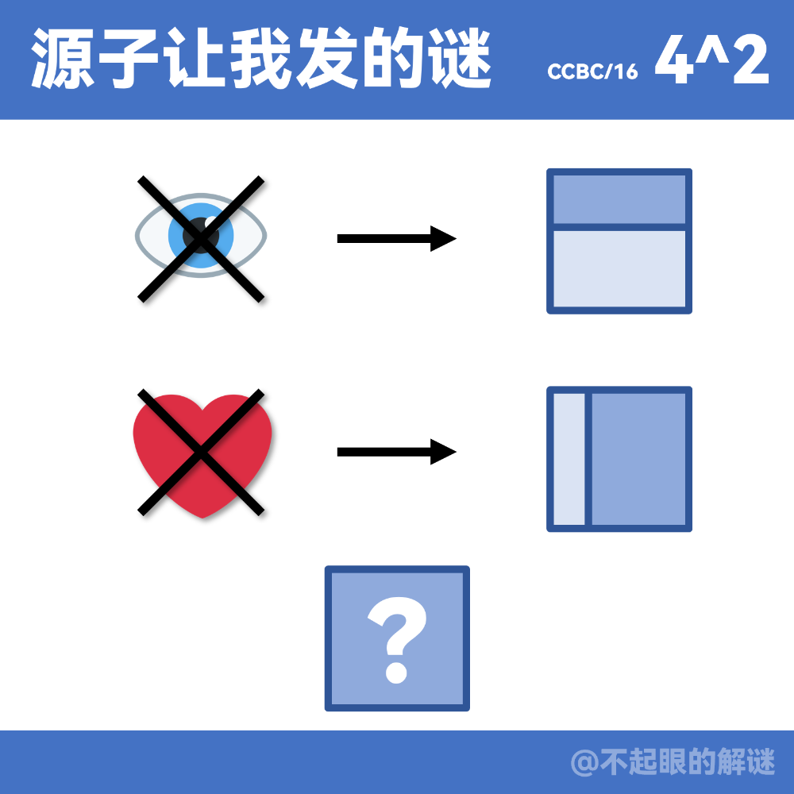

# 千字谜子题 209

## 题面

## 答案

`亡`

## 解析

第一行：目标以叉号，即失去目，也就是亡目，对应箭头右侧盲；
第一行：心标以叉号，即失去心，也就是心亡，对应箭头右侧忙；
提取底色较深的部件，答案“亡”。
补充说明：上面两行是一句话：“目亡则盲，心亡则忙。”

## 本地附件

- [9d2210a74824413397a15eeb6ffb962a.webp](../../../assets/static.cipherpuzzles.com/static/images/9d2210a74824413397a15eeb6ffb962a.webp)

来源：[https://ccbc16.cipherpuzzles.com/data/c16-qian-puzzle.json#cid=209](https://ccbc16.cipherpuzzles.com/data/c16-qian-puzzle.json#cid=209)
