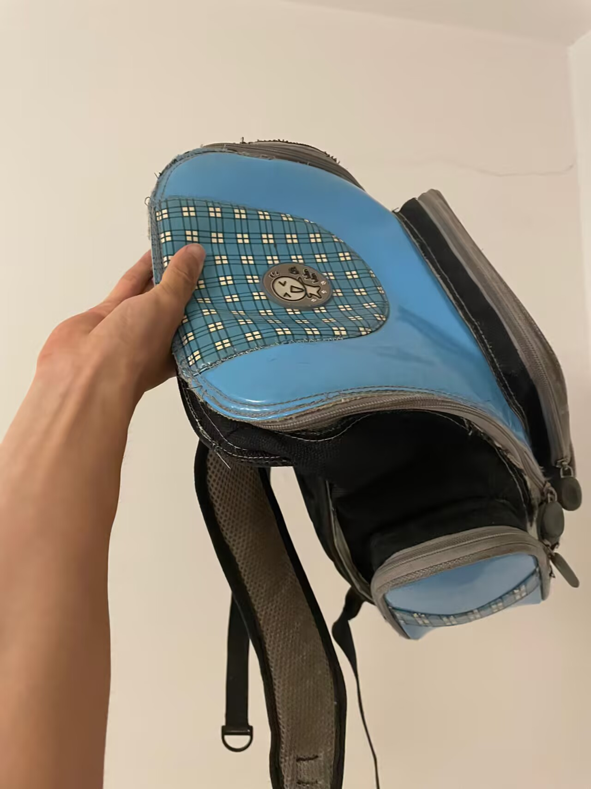

# 千字谜子题 21

## 题面

（八）

## 答案

`抱`

## 解析

图中左侧为一只手，右侧为书包，直接用手和包拼字得到答案“抱”。

## 本地附件

- [8ecc0fd8720a4d8289ffe1b4888e0c18.webp](../../../assets/static.cipherpuzzles.com/static/images/8ecc0fd8720a4d8289ffe1b4888e0c18.webp)

来源：[https://ccbc16.cipherpuzzles.com/data/c16-qian-puzzle.json#cid=21](https://ccbc16.cipherpuzzles.com/data/c16-qian-puzzle.json#cid=21)
