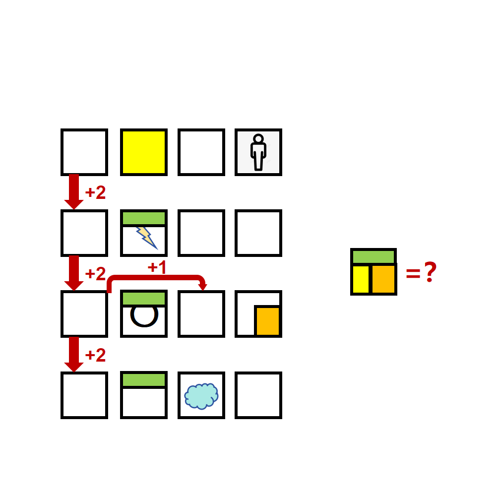

# 千字谜子题 210

## 题面

## 答案

`露`

## 解析

根据箭头提示，得到是跟数字相关的成语。通过图中提示的站立的小人，雷电图标，和“雷”相同部首的“零”（提示为汉字“〇”），以及“云”，猜得四个成语为三足鼎立、五雷轰顶、七零八落和九霄云外，根据颜色提示提取汉字成分重组得到答案“露”。

## 本地附件

- [47e56addaead452ab74ed0771b897d90.webp](../../../assets/static.cipherpuzzles.com/static/images/47e56addaead452ab74ed0771b897d90.webp)

来源：[https://ccbc16.cipherpuzzles.com/data/c16-qian-puzzle.json#cid=210](https://ccbc16.cipherpuzzles.com/data/c16-qian-puzzle.json#cid=210)
