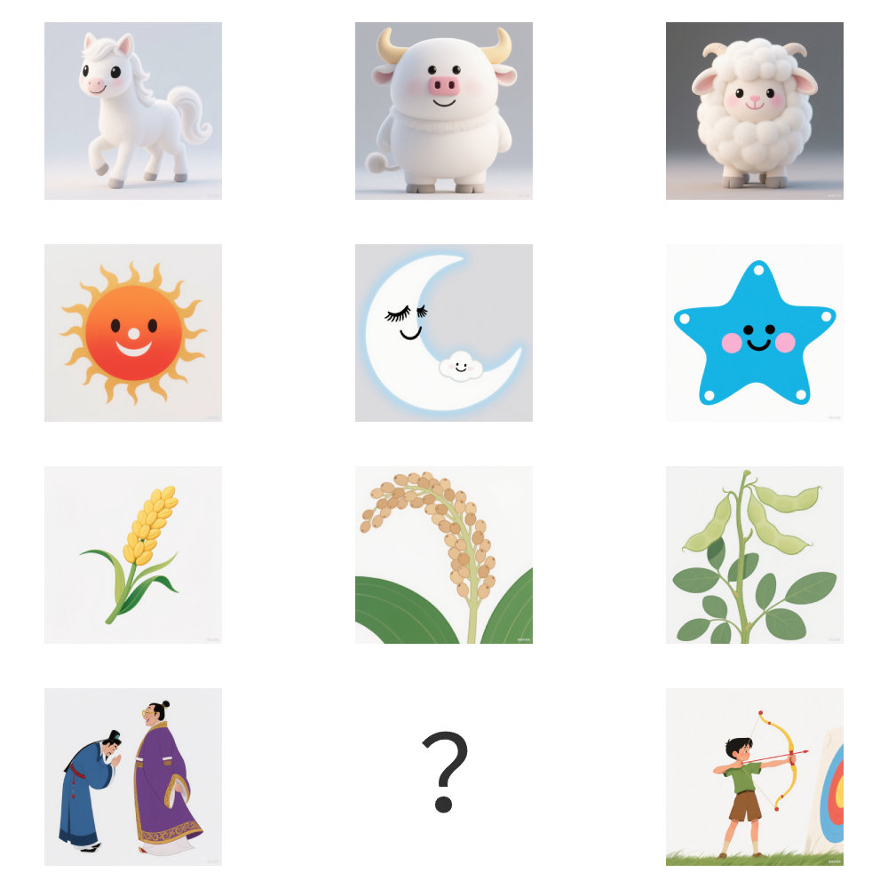

# 千字谜子题 211

## 题面

## 答案

`乐`

## 解析

三个图片一行，根据图片数量和内容，不难发现每行对应三字经中的一段

1：“马牛羊”，鸡犬豕。此六畜，人所饲。
2：三才者，天地人。三光者，“日月星”。
3：“稻粱菽”，麦黍稷。此六谷，人所食。
4：“礼乐射”，御书数。古六艺，今不具。

## 本地附件

- [2e2cba0cf2054d448f6fcc61201ce613.webp](../../../assets/static.cipherpuzzles.com/static/images/2e2cba0cf2054d448f6fcc61201ce613.webp)

来源：[https://ccbc16.cipherpuzzles.com/data/c16-qian-puzzle.json#cid=211](https://ccbc16.cipherpuzzles.com/data/c16-qian-puzzle.json#cid=211)
