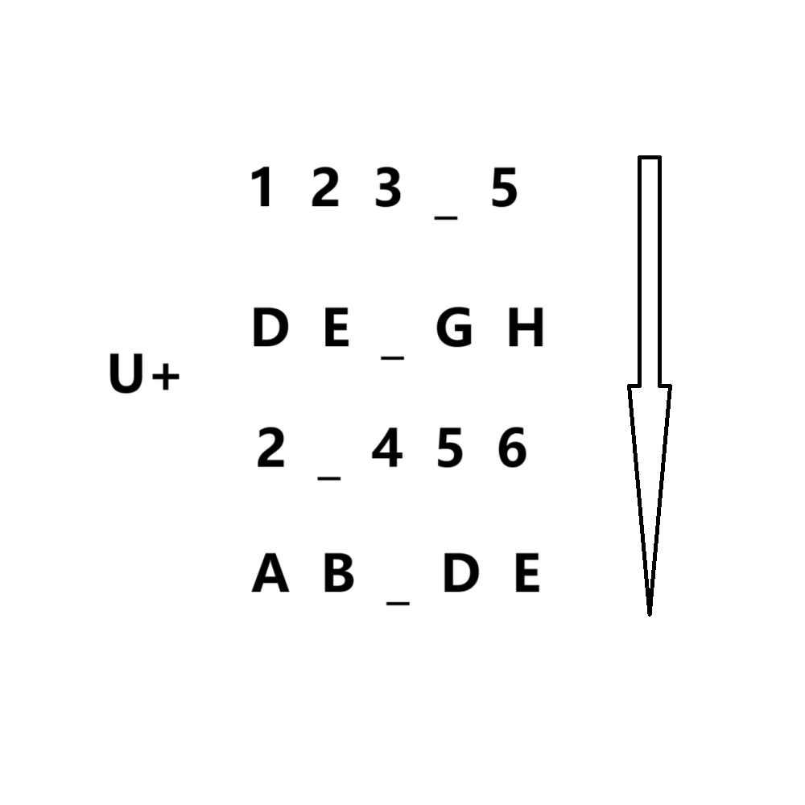

# 千字谜子题 212

## 题面

## 答案

`似`

## 解析

这是一道找规律题，注意到123_5之间为4，DE_GH之间为F，2_456之间为3，AB_DE之间为C，根据前面的U+提示可以得到U+4F3C，使用unicode码提取，提交 似 即可ac

## 本地附件

- [645e57cf9c8446d1a0da7ddeb380acd3.webp](../../../assets/static.cipherpuzzles.com/static/images/645e57cf9c8446d1a0da7ddeb380acd3.webp)

来源：[https://ccbc16.cipherpuzzles.com/data/c16-qian-puzzle.json#cid=212](https://ccbc16.cipherpuzzles.com/data/c16-qian-puzzle.json#cid=212)
