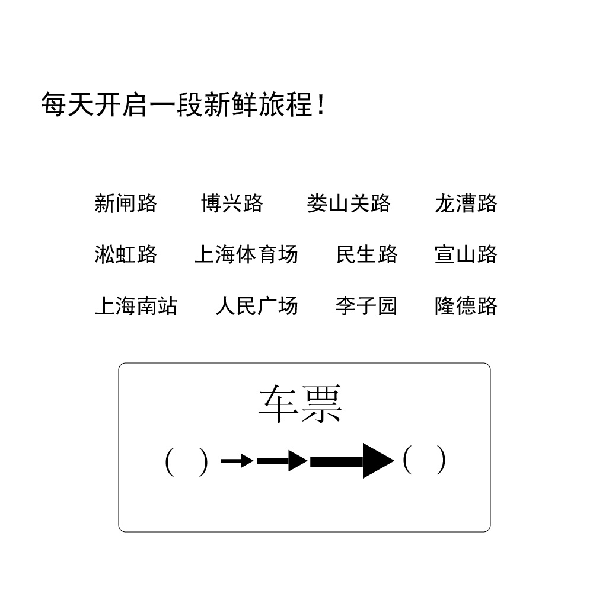

# 千字谜子题 213

## 题面

## 答案

`交`

## 解析

这12个地铁站属于上海市的地铁站，将这12个地铁站按照线路两两分为分为六组。由于新闸路，淞虹路，上海体育场，博兴路，李子园这五个车站均只属于一条线路，因此，对于其他同时属于多条线路的换乘车站，可以很快的排除组对。
新闸路和人民广场属于1号线，两个车站的连接线路，是一条向右下角的短斜线。
淞虹路和娄山关路属于2号线，两个车站的连接线路，是一条横线。
龙漕路和上海南站属于3号线，两个车站的连接线路，是一条向左下角的斜线。
宜山路和上海体育场属于4号线，两个车站的连接线路，是一条向右下角的斜线。
博兴路和民生路

## 本地附件

- [3cfc84a59f70442c871f84decaf89dc8.webp](../../../assets/static.cipherpuzzles.com/static/images/3cfc84a59f70442c871f84decaf89dc8.webp)

来源：[https://ccbc16.cipherpuzzles.com/data/c16-qian-puzzle.json#cid=213](https://ccbc16.cipherpuzzles.com/data/c16-qian-puzzle.json#cid=213)
