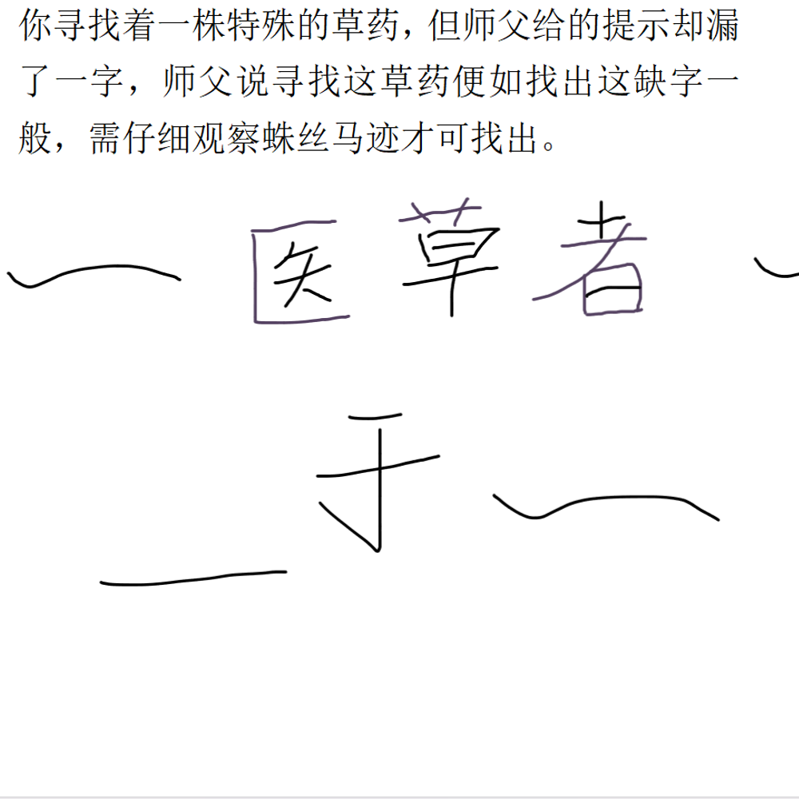

# 千字谜子题 215

## 题面

## 答案

`匿`

## 解析

仔细观察可得‘医草者’三字有些笔画略显不同，提取后重新组合可得答案‘匿’

## 本地附件

- [a9d3efbc93044c709e8875bb4356d3d9.webp](../../../assets/static.cipherpuzzles.com/static/images/a9d3efbc93044c709e8875bb4356d3d9.webp)

来源：[https://ccbc16.cipherpuzzles.com/data/c16-qian-puzzle.json#cid=215](https://ccbc16.cipherpuzzles.com/data/c16-qian-puzzle.json#cid=215)
