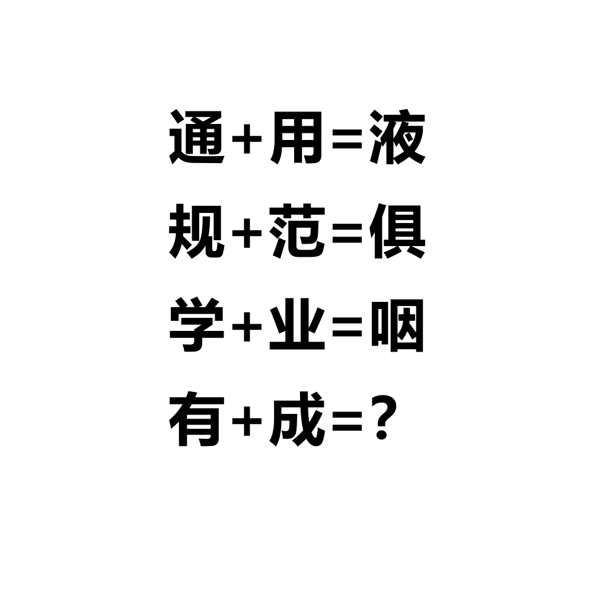

# 千字谜子题 217

## 题面

## 答案

`近`

## 解析

“通用规范”提示通用规范汉字表，搜索得到各个汉字对应数字：通-2145，用-283，液-2428，规-952，范-1010，俱-1962，学-1273，业-231，咽-1504，有-390，成-401。390+401=791，对应汉字“近”即为答案。

## 本地附件

- [abfc1d5f28a74d8ca44249aeb93ab725.webp](../../../assets/static.cipherpuzzles.com/static/images/abfc1d5f28a74d8ca44249aeb93ab725.webp)

来源：[https://ccbc16.cipherpuzzles.com/data/c16-qian-puzzle.json#cid=217](https://ccbc16.cipherpuzzles.com/data/c16-qian-puzzle.json#cid=217)
