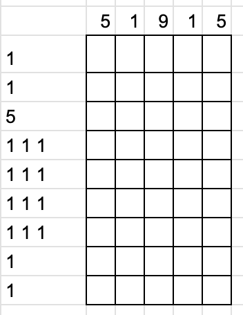

# 千字谜子题 218

## 题面

## 答案

`巾`

## 解析

数织

## 本地附件

- [7e0db2255a924f178793dd7ce39a7fec.webp](../../../assets/static.cipherpuzzles.com/static/images/7e0db2255a924f178793dd7ce39a7fec.webp)

来源：[https://ccbc16.cipherpuzzles.com/data/c16-qian-puzzle.json#cid=218](https://ccbc16.cipherpuzzles.com/data/c16-qian-puzzle.json#cid=218)
