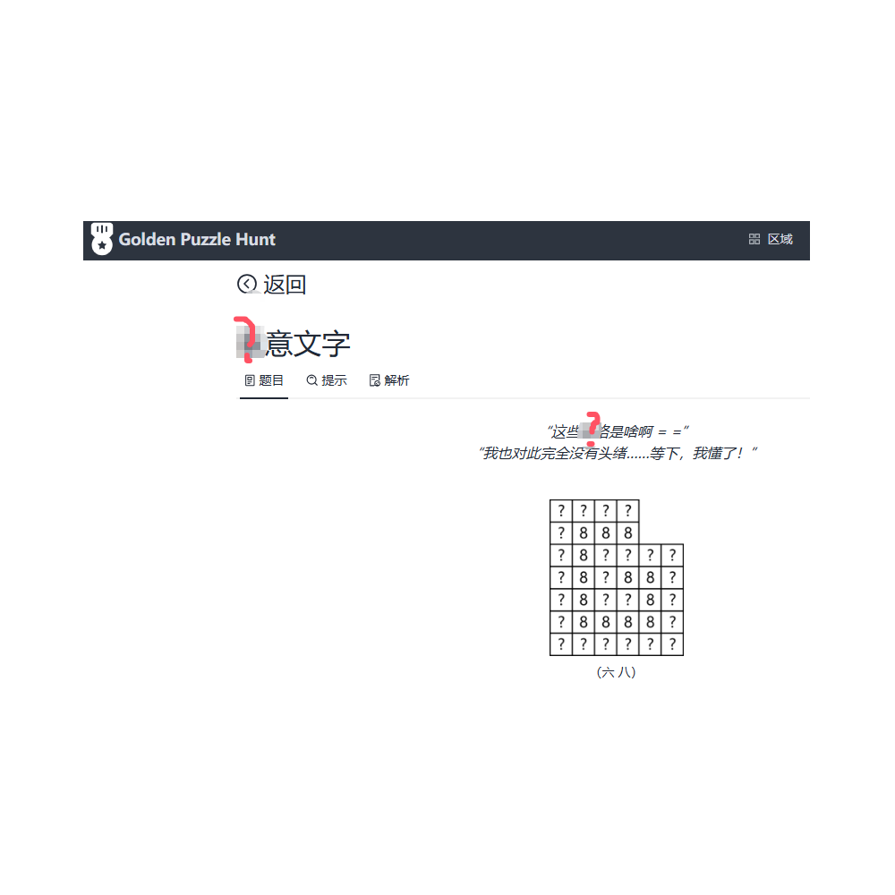

# 千字谜子题 22

## 题面

## 答案

`表`

## 解析

该题目出自金牌解谜，模糊的字为“表”。

## 本地附件

- [2ea3fd99584c4c7d981d6d6f24b00127.webp](../../../assets/static.cipherpuzzles.com/static/images/2ea3fd99584c4c7d981d6d6f24b00127.webp)

来源：[https://ccbc16.cipherpuzzles.com/data/c16-qian-puzzle.json#cid=22](https://ccbc16.cipherpuzzles.com/data/c16-qian-puzzle.json#cid=22)
