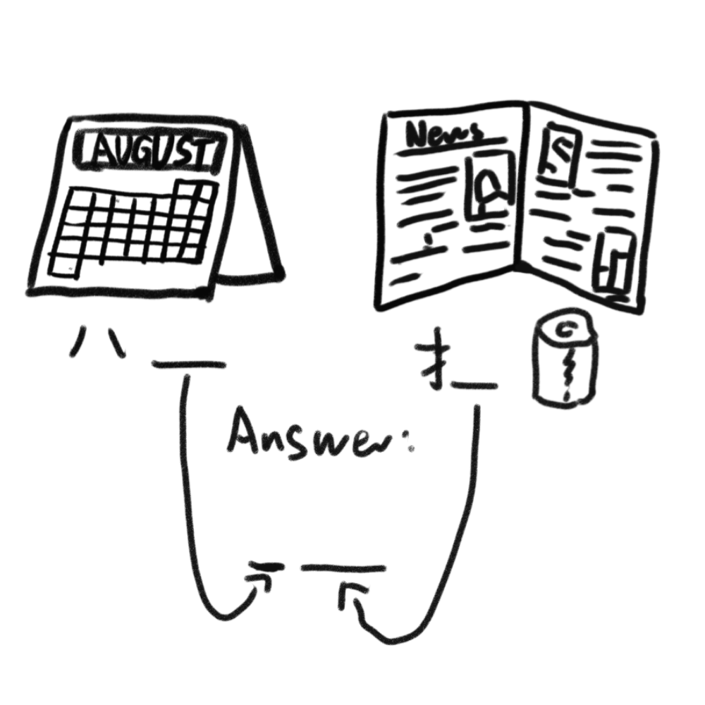

# 千字谜子题 220

## 题面

## 答案

`服`

## 解析

谜题的左半部分展示了一份八月的日历，因此得左侧横线应当填“月”。
谜题的右半部分展示了一份报纸，由于已经给出了提手旁，可以得出右侧横线上应当填“报”字的右半部分“𠬝”。
两侧横线下方的箭头指向最终答案的横线，将“月”作为左侧偏旁，与右侧的“𠬝”合在一起，可以得出谜题的答案为“服”。

## 本地附件

- [dc8c01ed92904a82b7251dc9c25c1481.webp](../../../assets/static.cipherpuzzles.com/static/images/dc8c01ed92904a82b7251dc9c25c1481.webp)

来源：[https://ccbc16.cipherpuzzles.com/data/c16-qian-puzzle.json#cid=220](https://ccbc16.cipherpuzzles.com/data/c16-qian-puzzle.json#cid=220)
