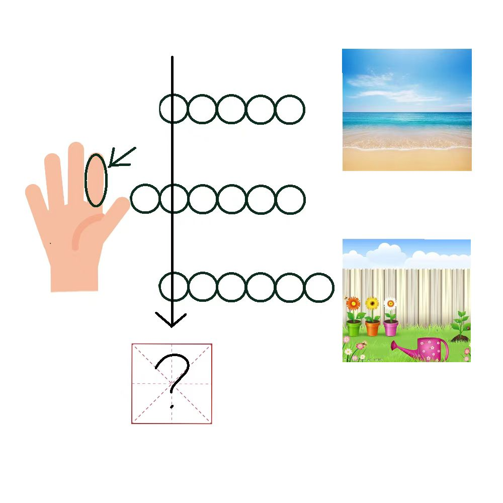

# 千字谜子题 221

## 题面

## 答案

`大`

## 解析

图中三个图片分别对应沙滩（beach），手指（finger），花园（garden）。将英文单词填入圆圈中，箭头经过b i g，也就是“大”的英文，箭头指向米字格指答案为一个中文汉字，也就是“大”。

## 本地附件

- [e58e5817b1074bbba62c2c656f7f0fba.webp](../../../assets/static.cipherpuzzles.com/static/images/e58e5817b1074bbba62c2c656f7f0fba.webp)

来源：[https://ccbc16.cipherpuzzles.com/data/c16-qian-puzzle.json#cid=221](https://ccbc16.cipherpuzzles.com/data/c16-qian-puzzle.json#cid=221)
