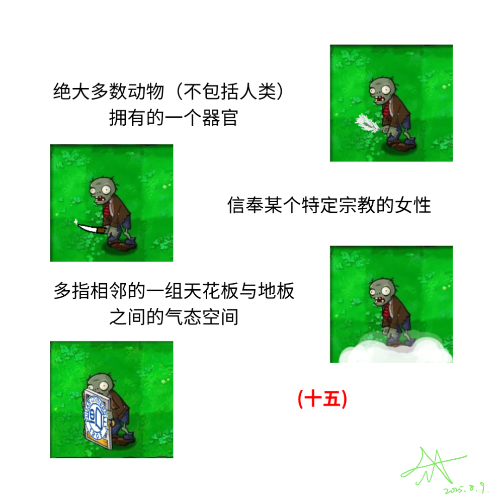

# 千字谜子题 222

## 题面

## 答案

`履`

## 解析

本题的四个图片分别对应了一个"尸"字旁的汉字, 前三个分别为"尾" "尼" "层", 第四只僵尸举着一个校徽, 观察得到挖空的部分是"复旦大学"的"復". 按照同样规则得到答案为履.

## 本地附件

- [9967c3be47f94d53a462a6b264b170d7.webp](../../../assets/static.cipherpuzzles.com/static/images/9967c3be47f94d53a462a6b264b170d7.webp)

来源：[https://ccbc16.cipherpuzzles.com/data/c16-qian-puzzle.json#cid=222](https://ccbc16.cipherpuzzles.com/data/c16-qian-puzzle.json#cid=222)
