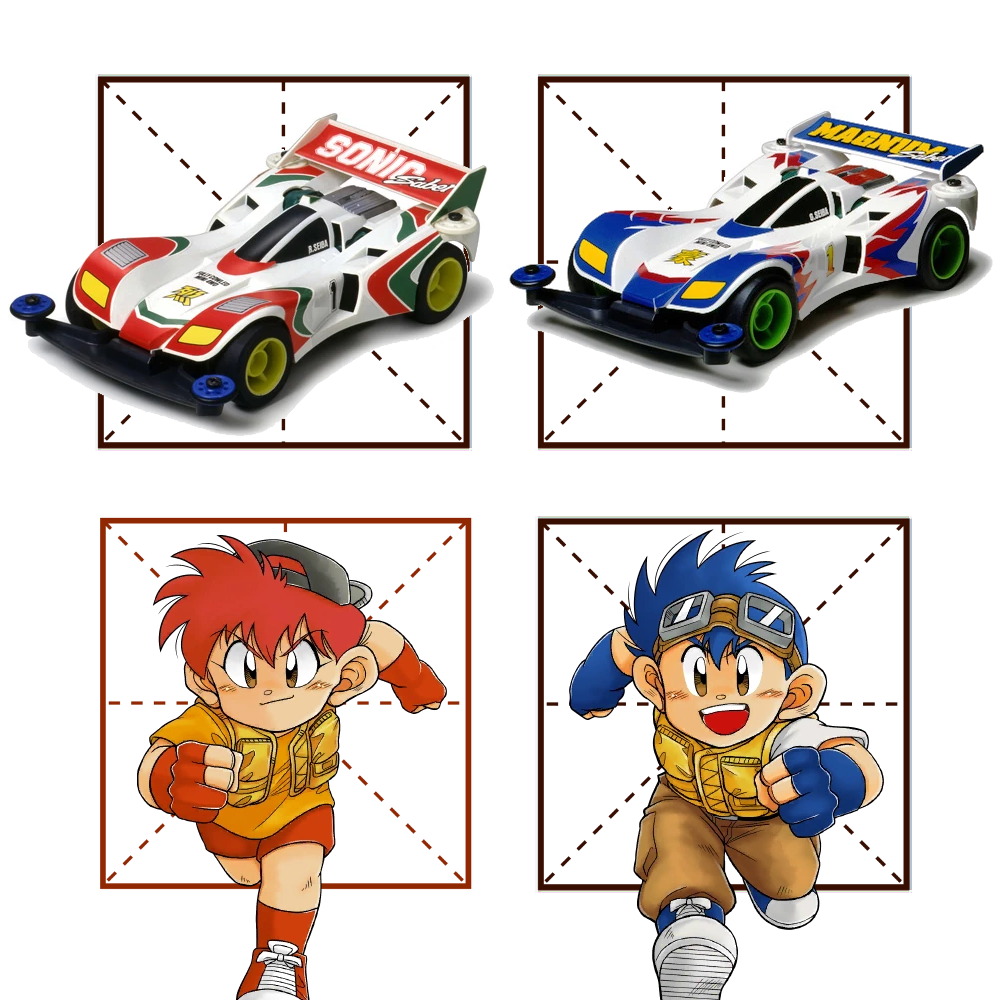

# 千字谜子题 223

## 题面

## 答案

`兄`

## 解析

动画名“四驱兄弟”四字中，“兄长星马烈”对应的汉字（“红色”田字格提示）。

## 本地附件

- [34acf694fb9b4f05ab8bc67f6eb1f68c.webp](../../../assets/static.cipherpuzzles.com/static/images/34acf694fb9b4f05ab8bc67f6eb1f68c.webp)

来源：[https://ccbc16.cipherpuzzles.com/data/c16-qian-puzzle.json#cid=223](https://ccbc16.cipherpuzzles.com/data/c16-qian-puzzle.json#cid=223)
