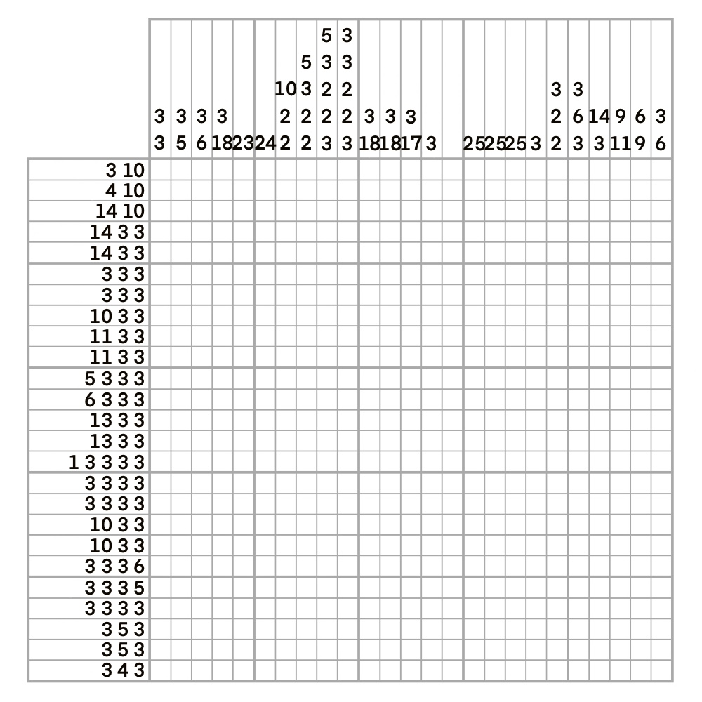

# 千字谜子题 224

## 题面

## 答案

`郁`

## 解析

数织规则，最终截出来的形状是郁!
[img-E2A114AD8ADD4963520EEF1D782C90B7.jpg](../../../assets/static.cipherpuzzles.com/static/images/90b54b3814104e26abd70ec3c56892a0.webp)

## 本地附件

- [05bca08e4b5e40f1a7309e786adbe1a7.webp](../../../assets/static.cipherpuzzles.com/static/images/05bca08e4b5e40f1a7309e786adbe1a7.webp)
- [90b54b3814104e26abd70ec3c56892a0.webp](../../../assets/static.cipherpuzzles.com/static/images/90b54b3814104e26abd70ec3c56892a0.webp)

来源：[https://ccbc16.cipherpuzzles.com/data/c16-qian-puzzle.json#cid=224](https://ccbc16.cipherpuzzles.com/data/c16-qian-puzzle.json#cid=224)
