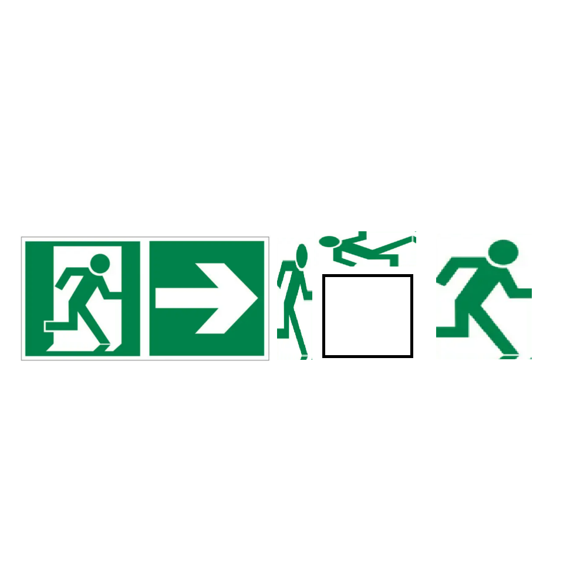

# 千字谜子题 225

## 题面

## 答案

`力`

## 解析

看图猜成语，安全出口代表词组“出口”，人形图案代表“人”字或单人旁，得出成语为出口伤人，方框处即为答案“力”。

## 本地附件

- [ecf3ddd417154f4c8c9e73ff9d21e2be.webp](../../../assets/static.cipherpuzzles.com/static/images/ecf3ddd417154f4c8c9e73ff9d21e2be.webp)

来源：[https://ccbc16.cipherpuzzles.com/data/c16-qian-puzzle.json#cid=225](https://ccbc16.cipherpuzzles.com/data/c16-qian-puzzle.json#cid=225)
