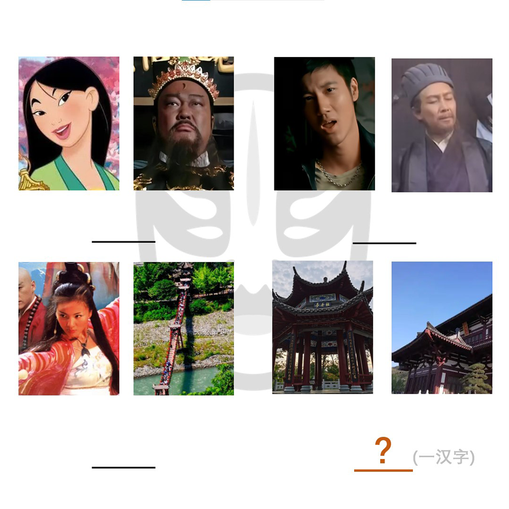

# 千字谜子题 226

## 题面

## 答案

`昆`

## 解析

8张图从左至右从上至下分别为花木兰、包青天；花田错（王力宏的《花田错》mv）、空城计；白蛇传、夫妻桥（百度可搜到图片）；牡丹亭、长生殿（图片上文字提示，且百度可搜到）。结合背景的脸谱logo暗示，可发现其分别是豫剧、京剧、川剧、昆曲的代表作，结合填空部分一汉字的要求，可知答案为“昆”。

## 本地附件

- [31a12b36f5c8479cb4b656aeb81587e2.webp](../../../assets/static.cipherpuzzles.com/static/images/31a12b36f5c8479cb4b656aeb81587e2.webp)

来源：[https://ccbc16.cipherpuzzles.com/data/c16-qian-puzzle.json#cid=226](https://ccbc16.cipherpuzzles.com/data/c16-qian-puzzle.json#cid=226)
