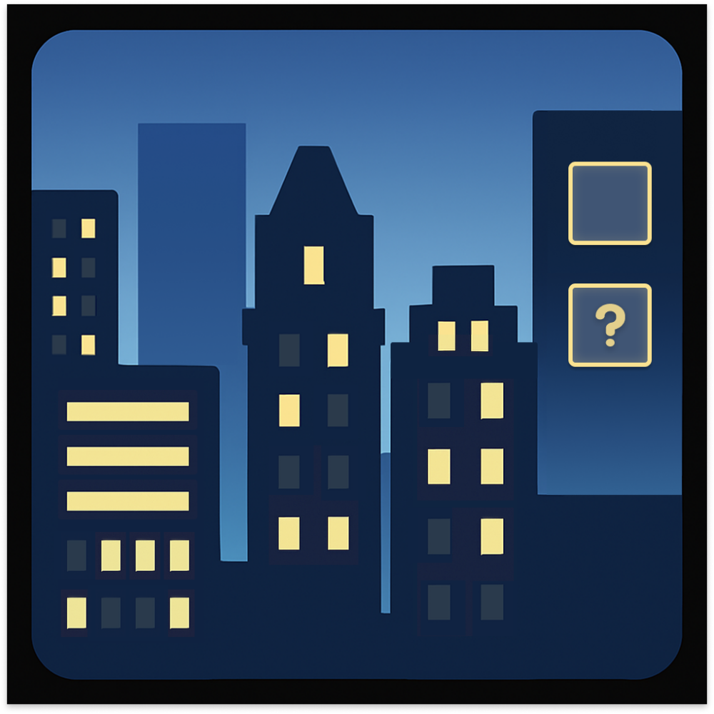

# 千字谜子题 227

## 题面

## 答案

`市`

## 解析

图里有四栋楼，每栋楼上有8个窗户，有明有暗，代表二进制。按照楼高排序，得到数列01100011 01101001 01110100 01111001，翻译成字母就是city。因为右边有两个格子，可知需要二字词组，翻译成中文得到城市。因为第二格里有问号，所以答案是市。

## 本地附件

- [60f8b68dedbd42a0872a8d5c219bcc1f.webp](../../../assets/static.cipherpuzzles.com/static/images/60f8b68dedbd42a0872a8d5c219bcc1f.webp)

来源：[https://ccbc16.cipherpuzzles.com/data/c16-qian-puzzle.json#cid=227](https://ccbc16.cipherpuzzles.com/data/c16-qian-puzzle.json#cid=227)
