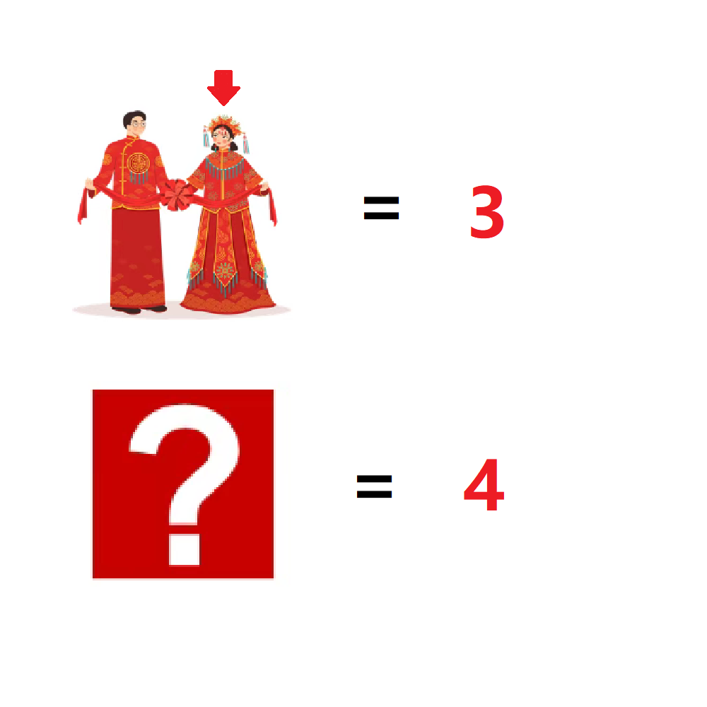

# 千字谜子题 228

## 题面

## 答案

`妾`

## 解析

出自成语“三妻四妾”，其中上图的箭头指向妻子。通过妻=3联系到成语三妻四妾，得到答案为“妾”。标题“成群”一词提示成语“妻妾成群”。

## 本地附件

- [6af676f4e7d546e8a3aaf00b6248d840.webp](../../../assets/static.cipherpuzzles.com/static/images/6af676f4e7d546e8a3aaf00b6248d840.webp)

来源：[https://ccbc16.cipherpuzzles.com/data/c16-qian-puzzle.json#cid=228](https://ccbc16.cipherpuzzles.com/data/c16-qian-puzzle.json#cid=228)
