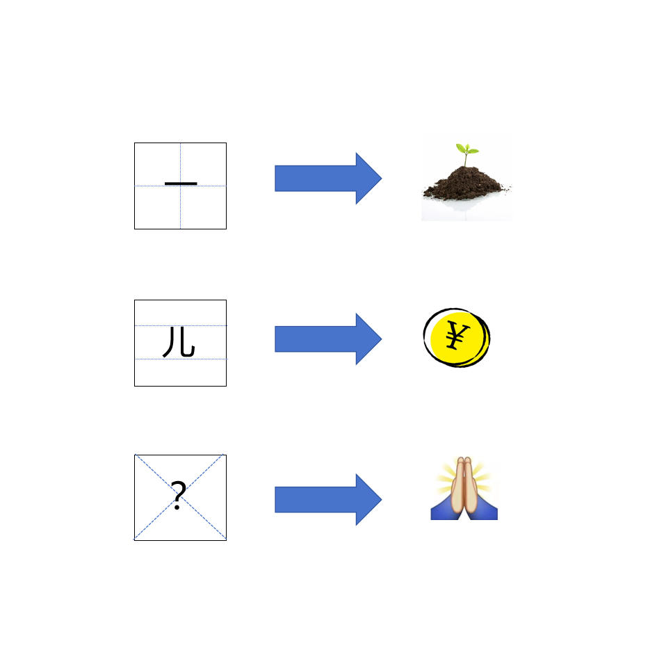

# 千字谜子题 229

## 题面

## 答案

`布`

## 解析

“十”字格中写着“一”，“一”的上方加“十”字组成“土”（配图为泥土）
“二”字格中写着“儿”，“儿”的上方加“二”字组成“元”（配图为钱币/元）
总结规律：格子内字a的上方加b字格，组成一个新字
第三行的表情一般意思为“祈祷”，但“祈祷”都是左右结构的字，与前面规律不符。转换一下思路，这个表情也代表“希望”，因此可以为“希”
“X” 字格中写着“？”，“？”上方和“X” 字组成“希”，因此“？”是布

## 本地附件

- [b1ce4b0659ad46919048a851323473e9.webp](../../../assets/static.cipherpuzzles.com/static/images/b1ce4b0659ad46919048a851323473e9.webp)

来源：[https://ccbc16.cipherpuzzles.com/data/c16-qian-puzzle.json#cid=229](https://ccbc16.cipherpuzzles.com/data/c16-qian-puzzle.json#cid=229)
