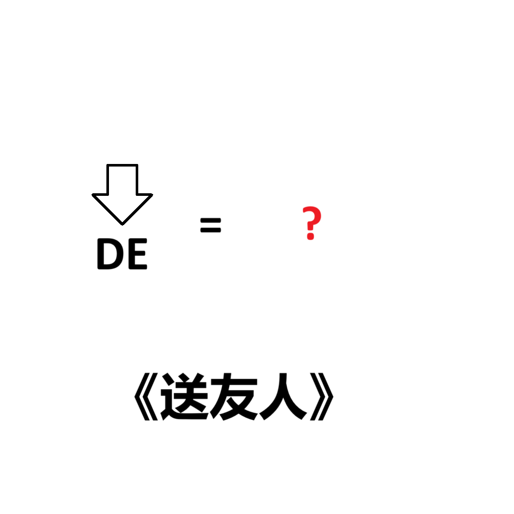

# 千字谜子题 23

## 题面

## 答案

`别`

## 解析

此地一为别（此 DE 为 别），所以答案是“别”

## 本地附件

- [f7dbe3bedd4e49ba9959e557c6036393.webp](../../../assets/static.cipherpuzzles.com/static/images/f7dbe3bedd4e49ba9959e557c6036393.webp)

来源：[https://ccbc16.cipherpuzzles.com/data/c16-qian-puzzle.json#cid=23](https://ccbc16.cipherpuzzles.com/data/c16-qian-puzzle.json#cid=23)
