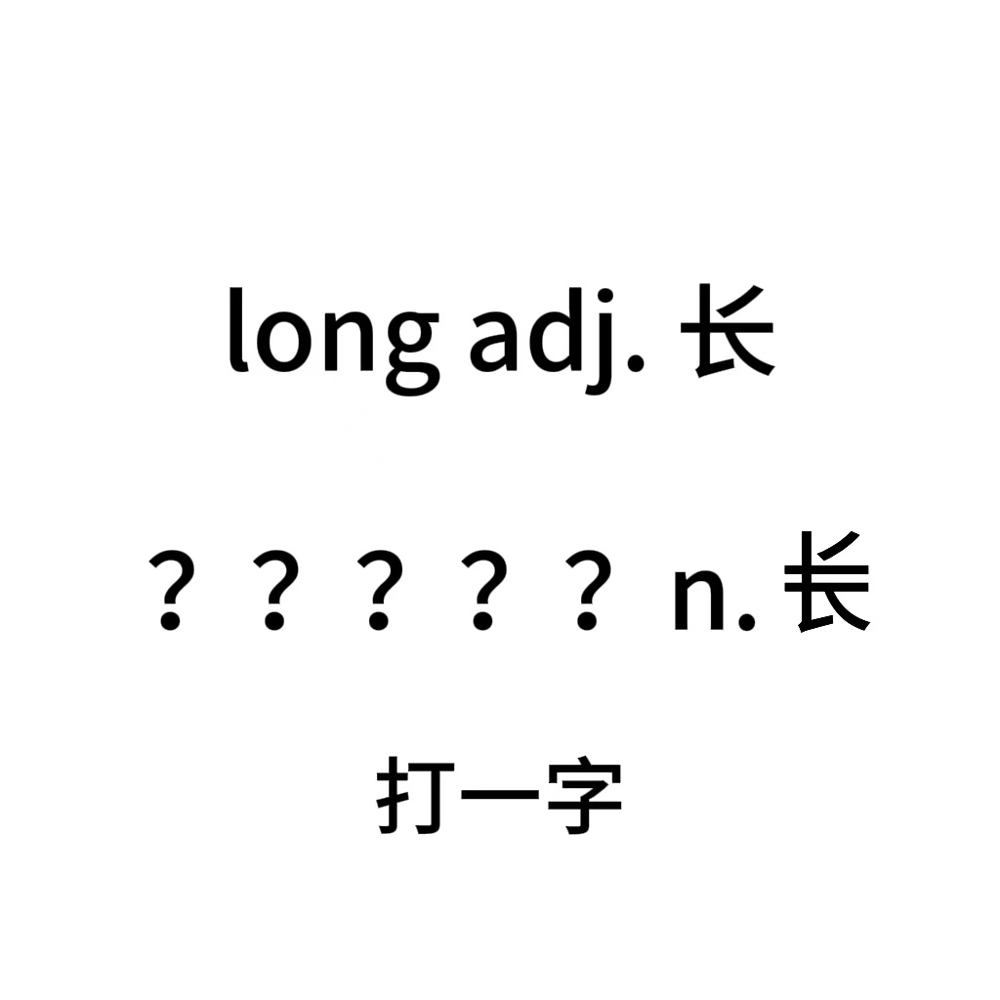

# 千字谜子题 230

## 题面

## 答案

`龙`

## 解析

“长”的英文是long，一共四画刚好对应四个字母，多一画后英文变为“loong”。一个汉字，得答案是“龙”

怎么写都感觉很别扭，干脆直接去掉改简单点了orz

## 本地附件

- [8233aad4349a405b83b2d3099e60a718.webp](../../../assets/static.cipherpuzzles.com/static/images/8233aad4349a405b83b2d3099e60a718.webp)

来源：[https://ccbc16.cipherpuzzles.com/data/c16-qian-puzzle.json#cid=230](https://ccbc16.cipherpuzzles.com/data/c16-qian-puzzle.json#cid=230)
