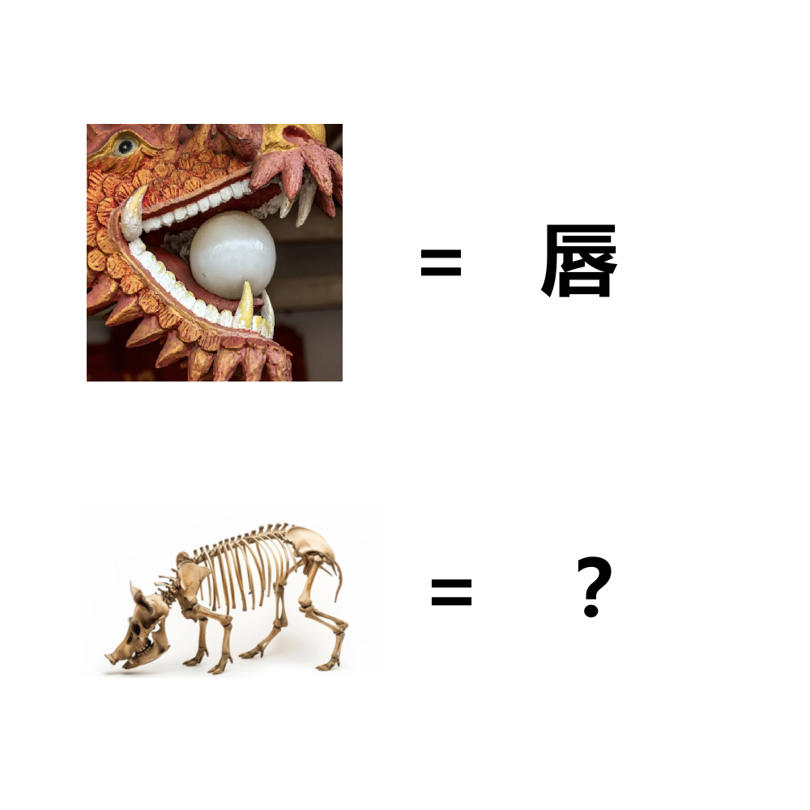

# 千字谜子题 231

## 题面

## 答案

`骸`

## 解析

龙=辰，龙+口=唇
猪=亥，猪+骨=骸

## 本地附件

- [e6063f65c8d24067bfd9820ac8af6787.webp](../../../assets/static.cipherpuzzles.com/static/images/e6063f65c8d24067bfd9820ac8af6787.webp)

来源：[https://ccbc16.cipherpuzzles.com/data/c16-qian-puzzle.json#cid=231](https://ccbc16.cipherpuzzles.com/data/c16-qian-puzzle.json#cid=231)
