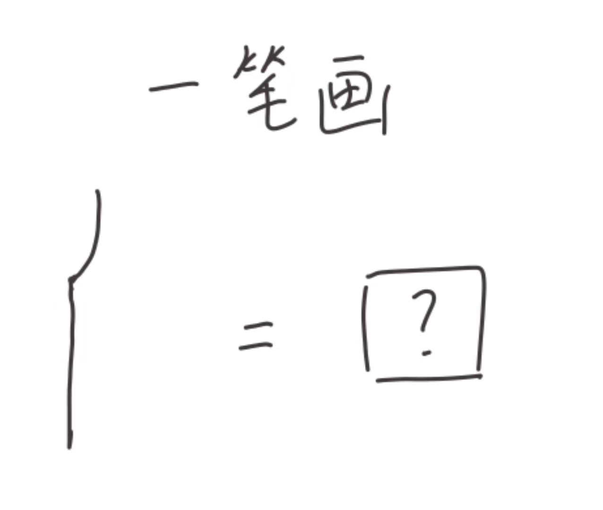

# 千字谜子题 232

## 题面

## 答案

`川`

## 解析

根据一笔画规则，可以得到该字为“川”

## 本地附件

- [f7c601345c6648679086ec86c46bfd6a.webp](../../../assets/static.cipherpuzzles.com/static/images/f7c601345c6648679086ec86c46bfd6a.webp)

来源：[https://ccbc16.cipherpuzzles.com/data/c16-qian-puzzle.json#cid=232](https://ccbc16.cipherpuzzles.com/data/c16-qian-puzzle.json#cid=232)
