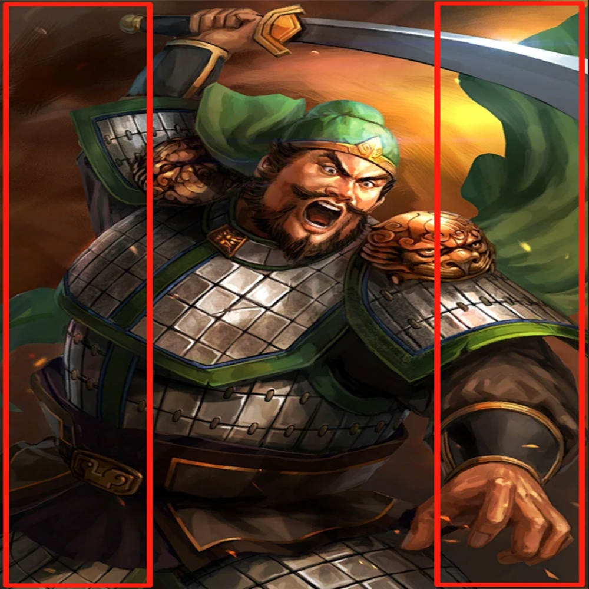

# 千字谜子题 233

## 题面

## 答案

`诸`

## 解析

图片中人物为许褚（网图），将图片四等分（时间紧迫，大概画了一下），提取红色方框内的文字部分，即可得诸

## 本地附件

- [eacb9603552f4fc6aaf9402f0a973222.webp](../../../assets/static.cipherpuzzles.com/static/images/eacb9603552f4fc6aaf9402f0a973222.webp)

来源：[https://ccbc16.cipherpuzzles.com/data/c16-qian-puzzle.json#cid=233](https://ccbc16.cipherpuzzles.com/data/c16-qian-puzzle.json#cid=233)
