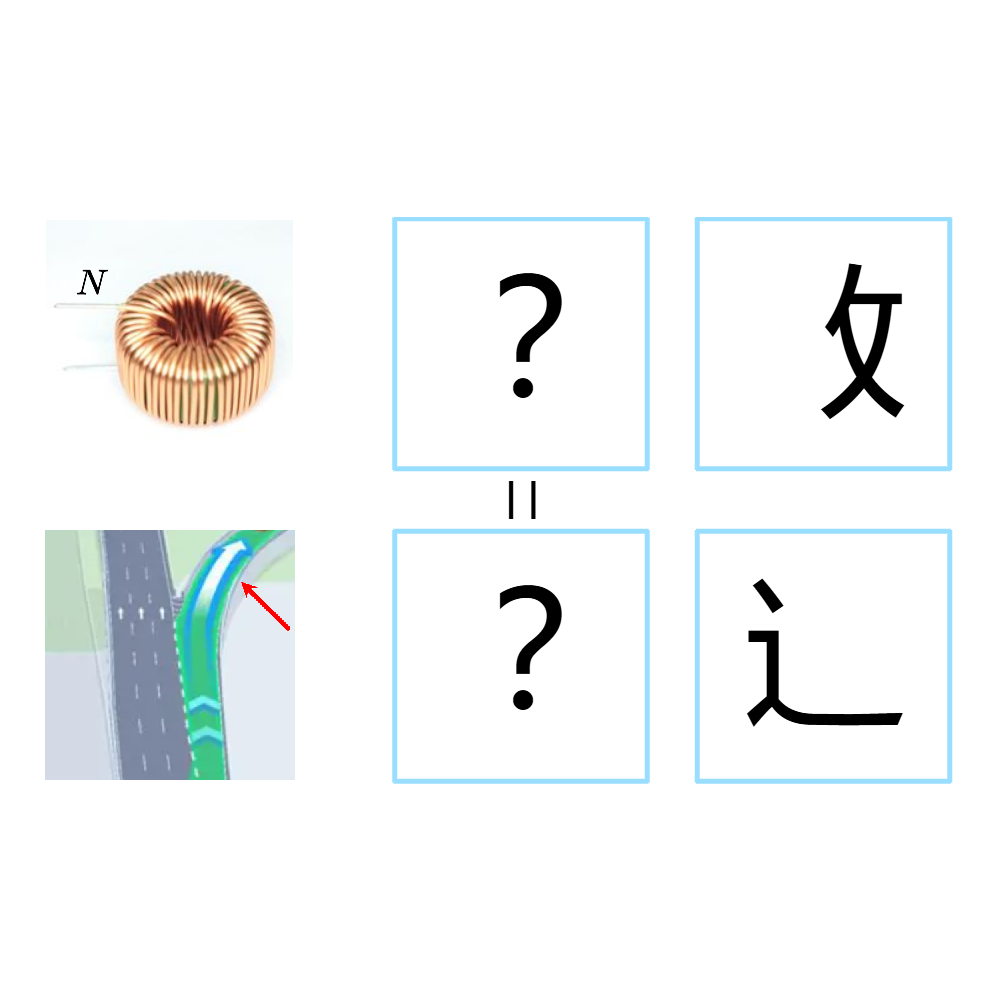

# 千字谜子题 235

## 题面

## 答案

`匝`

## 解析

图中上下两行的两个词的第一个字相同，第一行图中线圈的N表示匝数，第二行图中红色箭头指向匝道。故答案为“匝”。

## 本地附件

- [1f07825b4f8f49adae7f41ae3f84a3eb.webp](../../../assets/static.cipherpuzzles.com/static/images/1f07825b4f8f49adae7f41ae3f84a3eb.webp)

来源：[https://ccbc16.cipherpuzzles.com/data/c16-qian-puzzle.json#cid=235](https://ccbc16.cipherpuzzles.com/data/c16-qian-puzzle.json#cid=235)
