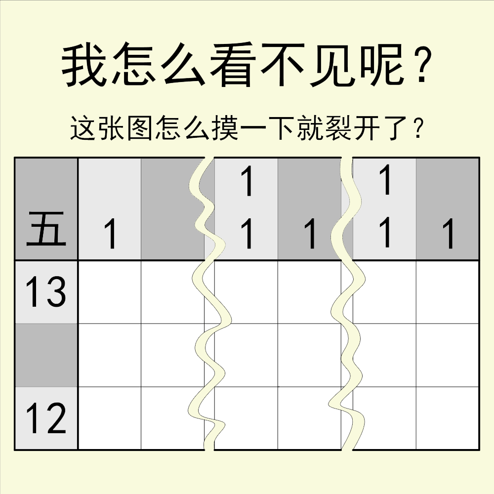

# 千字谜子题 236

## 题面

## 答案

`贡`

## 解析

显然这是一个数织，完成后根据标题“看不见”、“摸”以及2*3区块可以判断图案为盲文，翻译得AMU，再注意到左上角“五”提示五笔，通过AMU唯一五笔码得“贡”。

## 本地附件

- [53a815cf070e4be481bec04aff554e99.webp](../../../assets/static.cipherpuzzles.com/static/images/53a815cf070e4be481bec04aff554e99.webp)

来源：[https://ccbc16.cipherpuzzles.com/data/c16-qian-puzzle.json#cid=236](https://ccbc16.cipherpuzzles.com/data/c16-qian-puzzle.json#cid=236)
