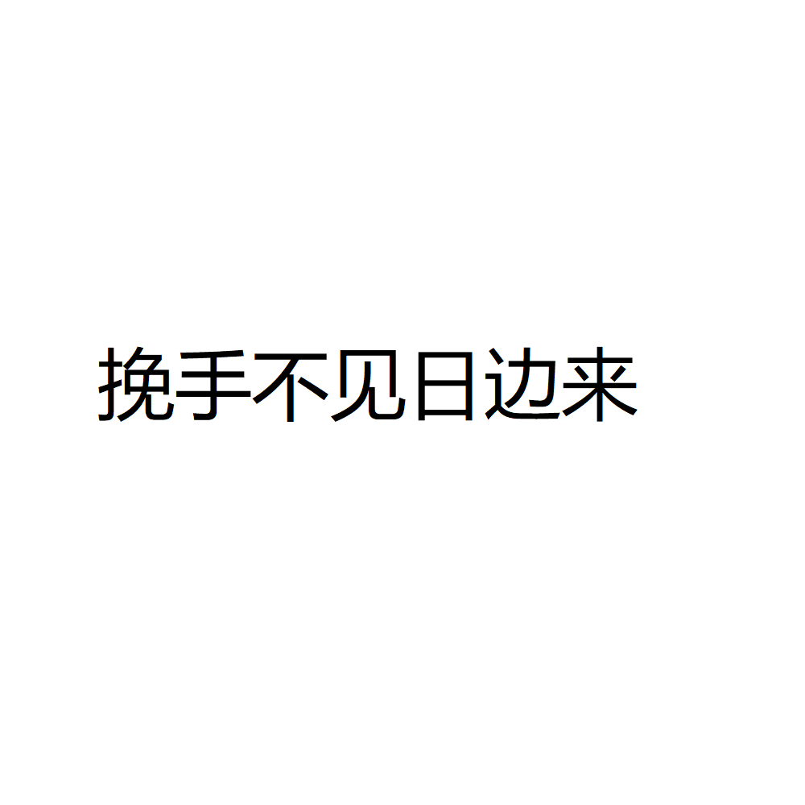

# 千字谜子题 237

## 题面

## 答案

`晚`

## 解析

“挽手不见”指“挽”字提手旁不见了，得“免”
“日边来”指这个“免”字旁边有一个“日”
“免”+“日”得到“晚”

## 本地附件

- [ea6a13e1b6ea4e548b900e63573dad00.webp](../../../assets/static.cipherpuzzles.com/static/images/ea6a13e1b6ea4e548b900e63573dad00.webp)

来源：[https://ccbc16.cipherpuzzles.com/data/c16-qian-puzzle.json#cid=237](https://ccbc16.cipherpuzzles.com/data/c16-qian-puzzle.json#cid=237)
