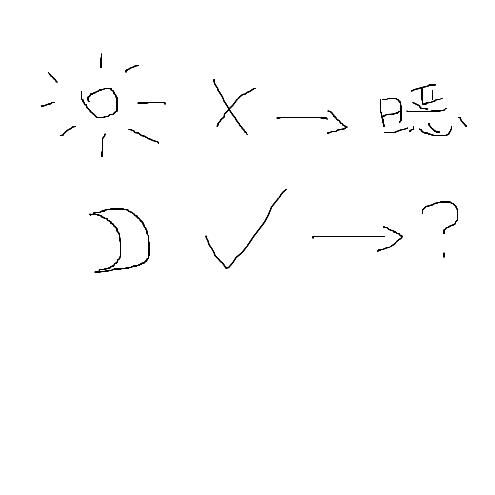

# 千字谜子题 238

## 题面

## 答案

`膳`

## 解析

日恶
月善

## 本地附件

- [6580894f15884c36ac2db4e66f7a152c.webp](../../../assets/static.cipherpuzzles.com/static/images/6580894f15884c36ac2db4e66f7a152c.webp)

来源：[https://ccbc16.cipherpuzzles.com/data/c16-qian-puzzle.json#cid=238](https://ccbc16.cipherpuzzles.com/data/c16-qian-puzzle.json#cid=238)
