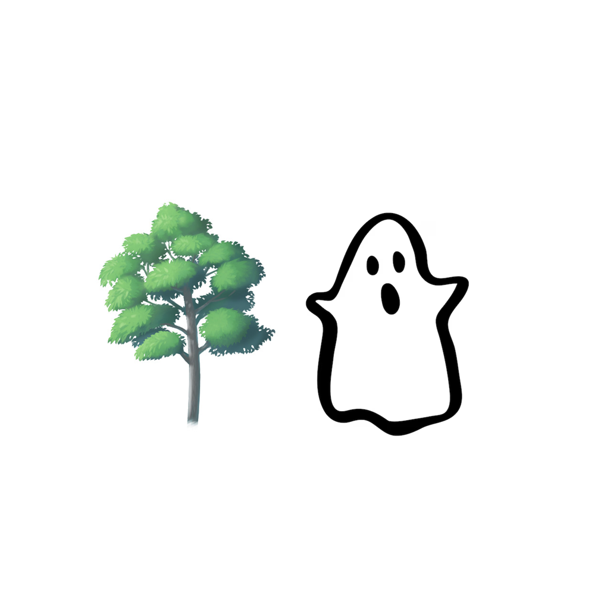

# 千字谜子题 24

## 题面

## 答案

`槐`

## 解析

图片暗示“木”字+“鬼”字就是“槐”字。

## 本地附件

- [8599f6c1a0144c849d83afd88a16aa05.webp](../../../assets/static.cipherpuzzles.com/static/images/8599f6c1a0144c849d83afd88a16aa05.webp)

来源：[https://ccbc16.cipherpuzzles.com/data/c16-qian-puzzle.json#cid=24](https://ccbc16.cipherpuzzles.com/data/c16-qian-puzzle.json#cid=24)
