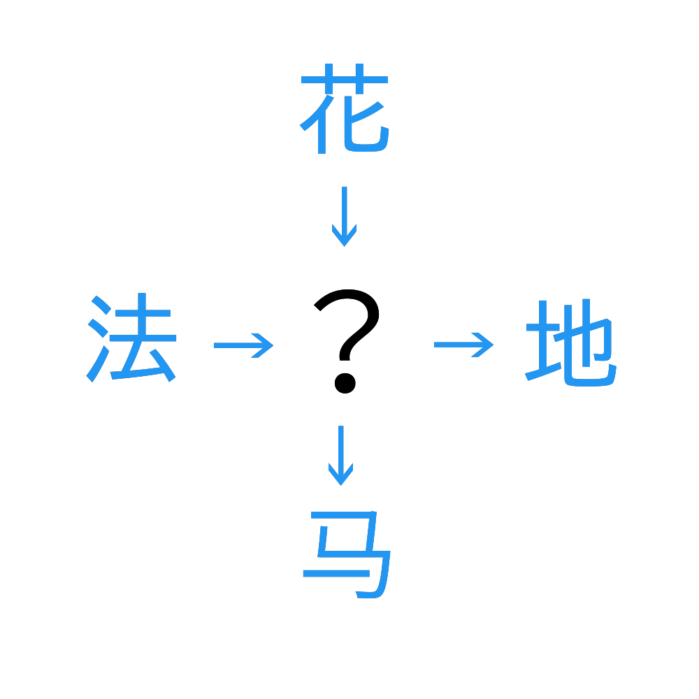

# 千字谜子题 240

## 题面

## 答案

`海`

## 解析

组词猜字 花海 法海 海地 海马

## 本地附件

- [9640da3edbf1467994051bde8f1de8d2.webp](../../../assets/static.cipherpuzzles.com/static/images/9640da3edbf1467994051bde8f1de8d2.webp)

来源：[https://ccbc16.cipherpuzzles.com/data/c16-qian-puzzle.json#cid=240](https://ccbc16.cipherpuzzles.com/data/c16-qian-puzzle.json#cid=240)
