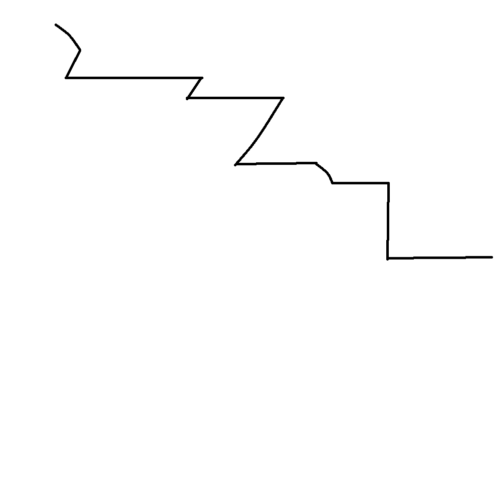

# 千字谜子题 241

## 题面

## 答案

`室`

## 解析

做法同CCBC16谜题《一笔画》。图中是【室】按照笔顺进行一笔画的结果。

## 本地附件

- [1d04dbc8c4a140bba4726c9231d7e1fa.webp](../../../assets/static.cipherpuzzles.com/static/images/1d04dbc8c4a140bba4726c9231d7e1fa.webp)

来源：[https://ccbc16.cipherpuzzles.com/data/c16-qian-puzzle.json#cid=241](https://ccbc16.cipherpuzzles.com/data/c16-qian-puzzle.json#cid=241)
