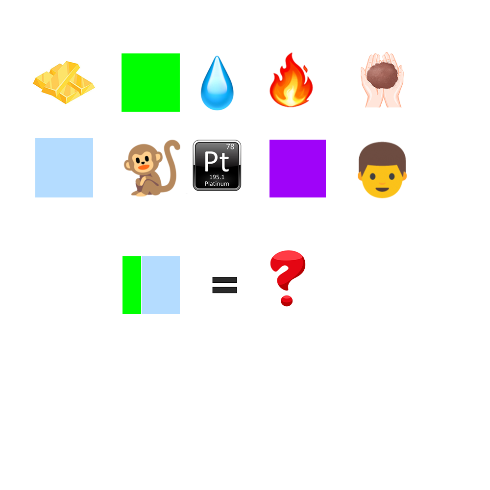

# 千字谜子题 242

## 题面

## 答案

`松`

## 解析

第一行为五行金木水火土的emoji，第二行是公侯伯子男的谐音emoji。

## 本地附件

- [aae2fbc302694557aa495d475fb7b8e1.webp](../../../assets/static.cipherpuzzles.com/static/images/aae2fbc302694557aa495d475fb7b8e1.webp)

来源：[https://ccbc16.cipherpuzzles.com/data/c16-qian-puzzle.json#cid=242](https://ccbc16.cipherpuzzles.com/data/c16-qian-puzzle.json#cid=242)
