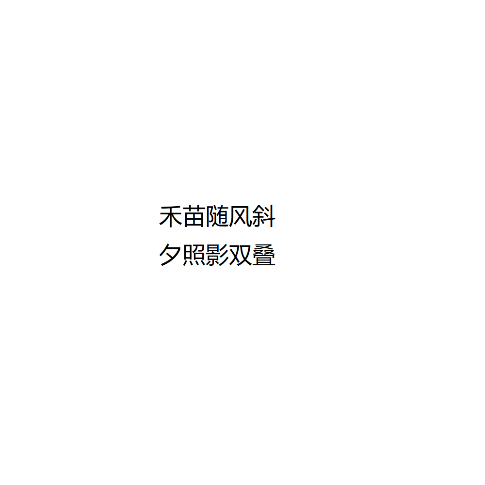

# 千字谜子题 243

## 题面

## 答案

`移`

## 解析

禾字被风吹斜写在左边，右边夕字和自己影子双双叠在一起得到多，合在一起是移

## 本地附件

- [81de304ca8e646ffb5367b492665c4b1.webp](../../../assets/static.cipherpuzzles.com/static/images/81de304ca8e646ffb5367b492665c4b1.webp)

来源：[https://ccbc16.cipherpuzzles.com/data/c16-qian-puzzle.json#cid=243](https://ccbc16.cipherpuzzles.com/data/c16-qian-puzzle.json#cid=243)
