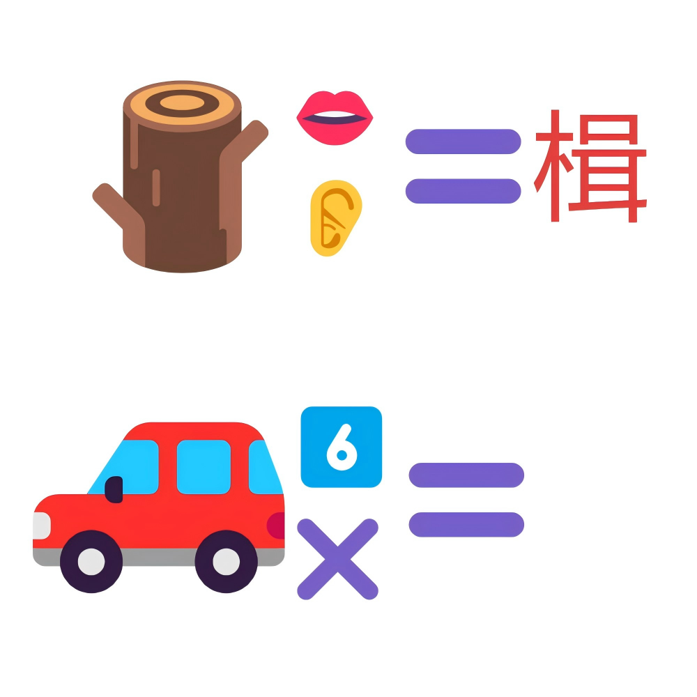

# 千字谜子题 245

## 题面

## 答案

`较`

## 解析

简单的emoji谜题

## 本地附件

- [5ffc0979efc94966aabe8b14e07401af.webp](../../../assets/static.cipherpuzzles.com/static/images/5ffc0979efc94966aabe8b14e07401af.webp)

来源：[https://ccbc16.cipherpuzzles.com/data/c16-qian-puzzle.json#cid=245](https://ccbc16.cipherpuzzles.com/data/c16-qian-puzzle.json#cid=245)
