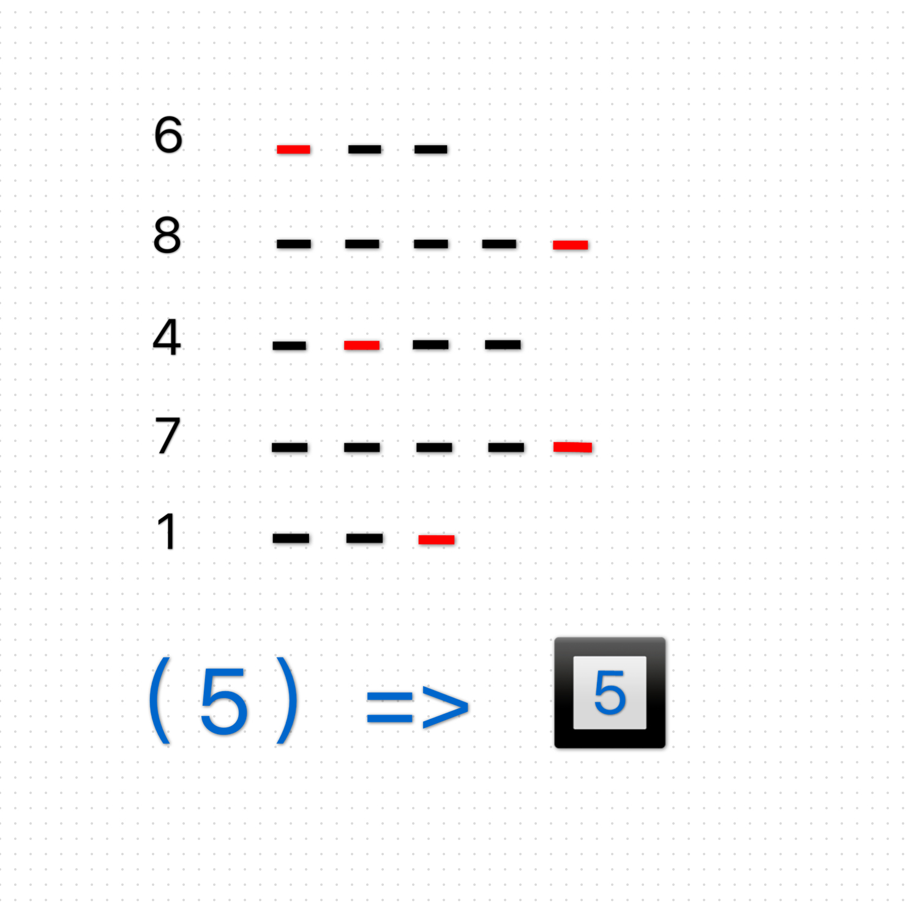

# 千字谜子题 246

## 题面

## 答案

`石`

## 解析

数字转换成英文，提取红色字母，得到英文单词stone，再转换成一个5笔的中文字，石

## 本地附件

- [7b8ad705b509492eb920ca095a3f5a91.webp](../../../assets/static.cipherpuzzles.com/static/images/7b8ad705b509492eb920ca095a3f5a91.webp)

来源：[https://ccbc16.cipherpuzzles.com/data/c16-qian-puzzle.json#cid=246](https://ccbc16.cipherpuzzles.com/data/c16-qian-puzzle.json#cid=246)
