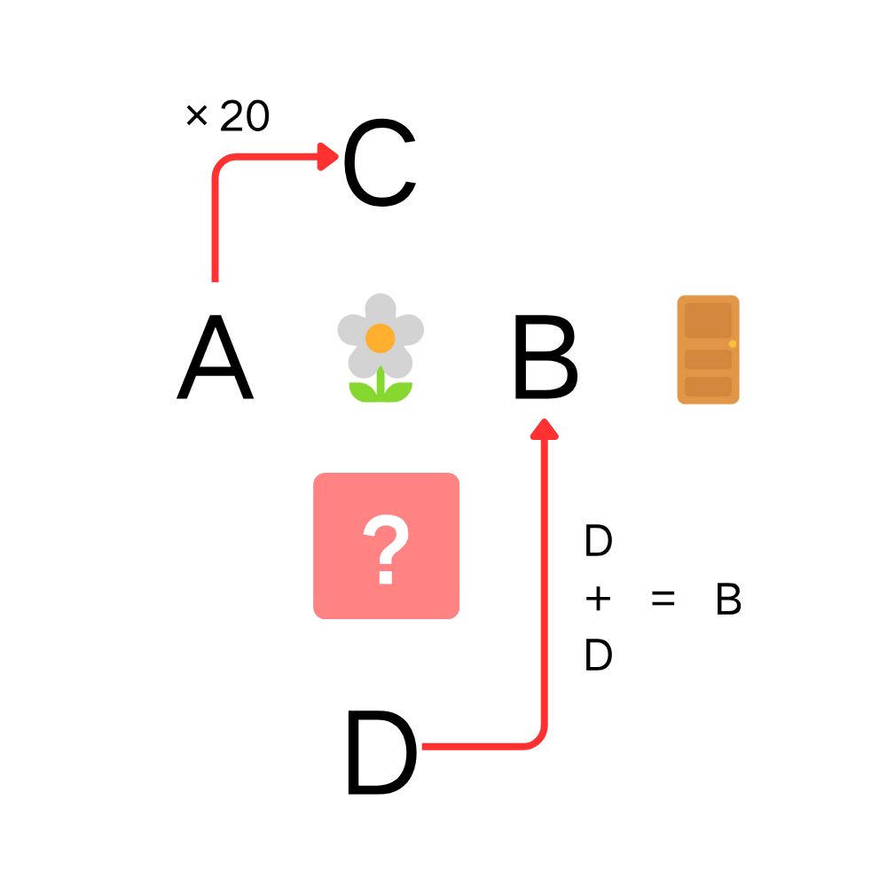

# 千字谜子题 247

## 题面

## 答案

`凋`

## 解析

读图得到“花”和“门”，通过左上角“×20”考虑“A”“B”“C”“D”均为数字，横向可以联想或检索到成语“五花八门”，5×20得到100，8的数字字形可以由两个0上下拼接得到，纵向得到“百花？零”，同样考虑成语，唯一解为“百花凋零”，问号处答案为“凋”。

## 本地附件

- [84de4e96a7c542199bec77400636ae22.webp](../../../assets/static.cipherpuzzles.com/static/images/84de4e96a7c542199bec77400636ae22.webp)

来源：[https://ccbc16.cipherpuzzles.com/data/c16-qian-puzzle.json#cid=247](https://ccbc16.cipherpuzzles.com/data/c16-qian-puzzle.json#cid=247)
