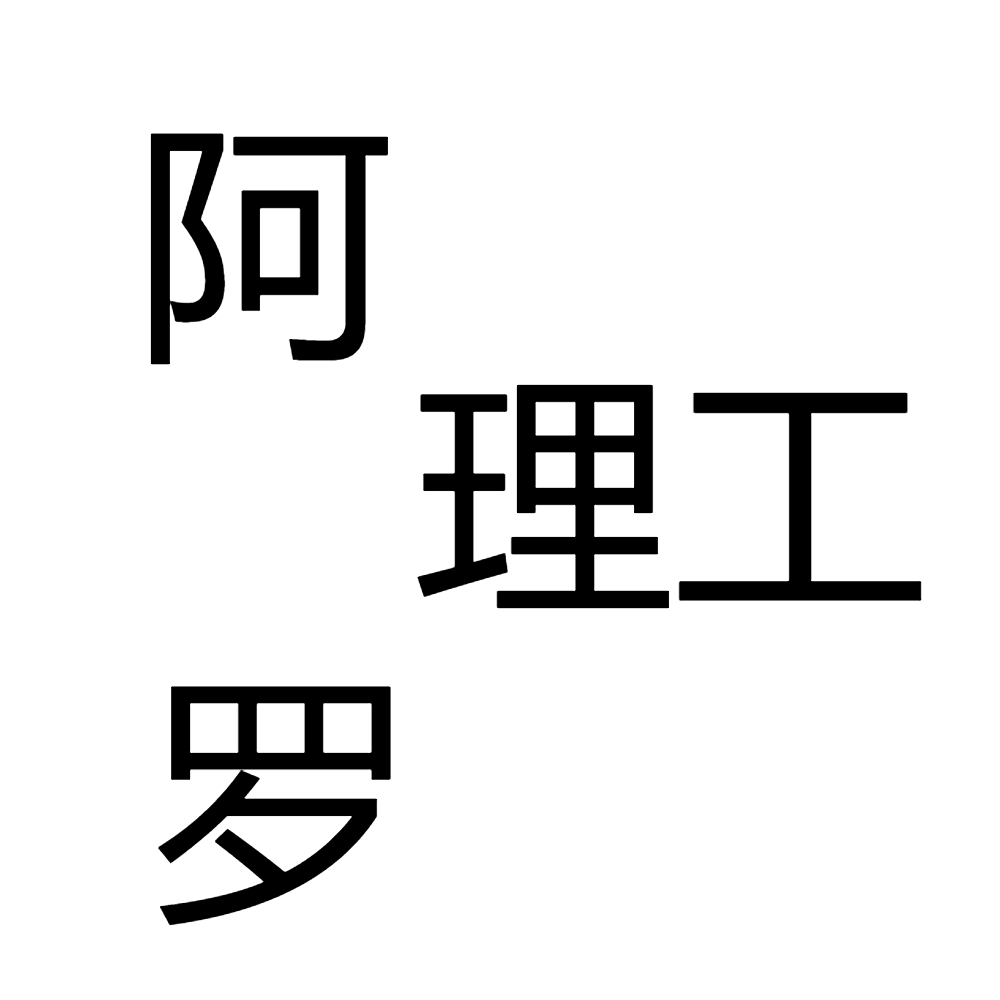

# 千字谜子题 249

## 题面

## 答案

`修`

## 解析

这是一个纵横字谜，在空白处填上正确的字就可以得到答案[修]。

## 本地附件

- [bf66ec37d2c14c07a7f42c58192326bf.webp](../../../assets/static.cipherpuzzles.com/static/images/bf66ec37d2c14c07a7f42c58192326bf.webp)

来源：[https://ccbc16.cipherpuzzles.com/data/c16-qian-puzzle.json#cid=249](https://ccbc16.cipherpuzzles.com/data/c16-qian-puzzle.json#cid=249)
