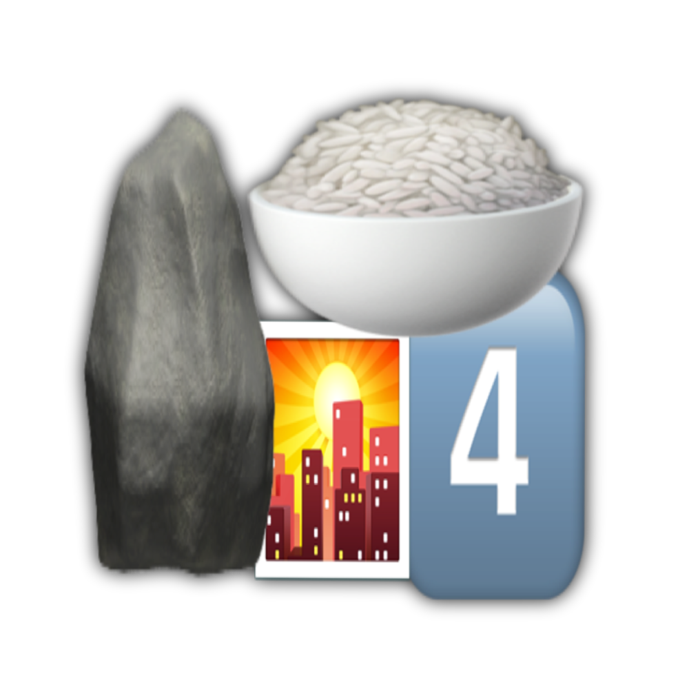

# 千字谜子题 25

## 题面

## 答案

`磷`

## 解析

🪨=石 🍚=米 🌇=夕 4️⃣是象形

## 本地附件

- [2507be7619bf4762aed90eec9ac589d9.webp](../../../assets/static.cipherpuzzles.com/static/images/2507be7619bf4762aed90eec9ac589d9.webp)

来源：[https://ccbc16.cipherpuzzles.com/data/c16-qian-puzzle.json#cid=25](https://ccbc16.cipherpuzzles.com/data/c16-qian-puzzle.json#cid=25)
