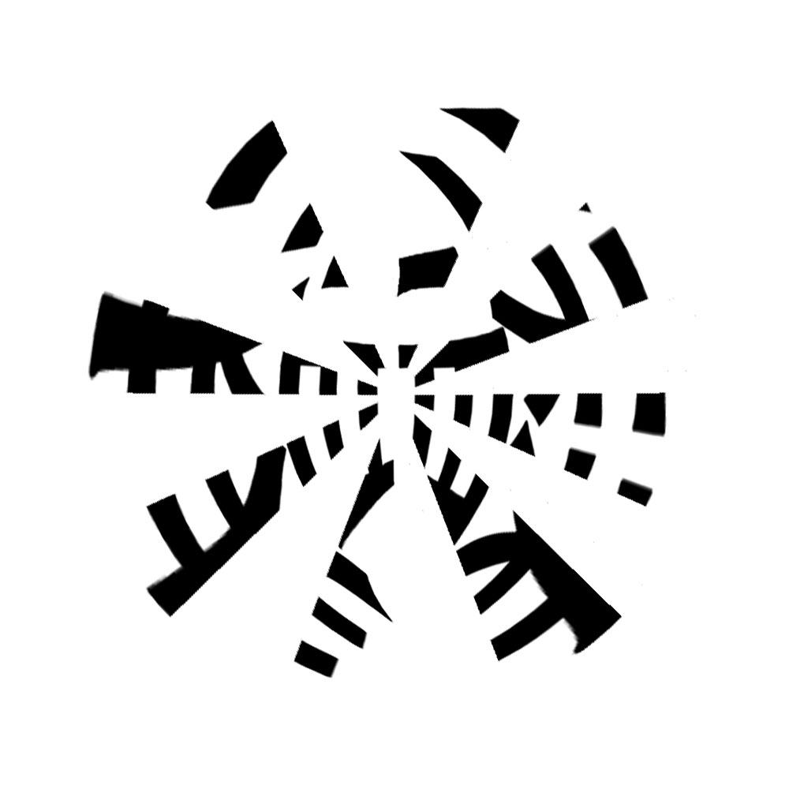

# 千字谜子题 250

## 题面

## 答案

`潜`

## 解析

将在这张图片沿着一条过中心的直线折叠，可以得到一个形变填充成半圆形的“潜”字。

## 本地附件

- [3d14088b01a74d4892d26e55429cda3b.webp](../../../assets/static.cipherpuzzles.com/static/images/3d14088b01a74d4892d26e55429cda3b.webp)

来源：[https://ccbc16.cipherpuzzles.com/data/c16-qian-puzzle.json#cid=250](https://ccbc16.cipherpuzzles.com/data/c16-qian-puzzle.json#cid=250)
