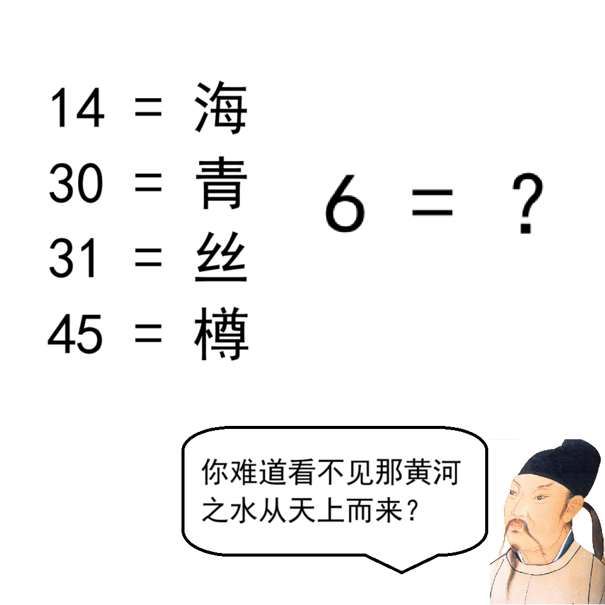

# 千字谜子题 251

## 题面

## 答案

`之`

## 解析

图片下半部分的人物是李白，通过他说的话可以联想到《将进酒》。可以发现，“海”、“青”、“丝”、“樽”四个字都在诗中出现一次，并且14、30、31、45就是它们在诗中的位置。所以6代表的就是《将进酒》的第六个字，即“之”

## 本地附件

- [e5e3b4f3cc394b78ad8b6e75ad88c8a8.webp](../../../assets/static.cipherpuzzles.com/static/images/e5e3b4f3cc394b78ad8b6e75ad88c8a8.webp)

来源：[https://ccbc16.cipherpuzzles.com/data/c16-qian-puzzle.json#cid=251](https://ccbc16.cipherpuzzles.com/data/c16-qian-puzzle.json#cid=251)
