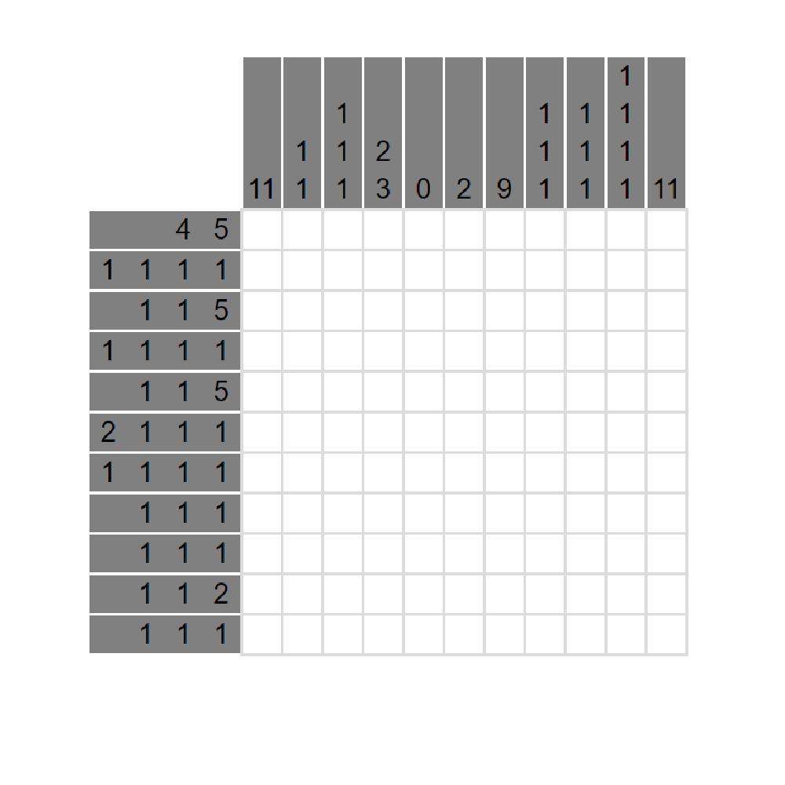

# 千字谜子题 252

## 题面

## 答案

`阴`

## 解析

这是一个数织谜题，拥有唯一解，解为“阴”字

## 本地附件

- [e3d803b606054b2c9a15378f7cddbb8f.webp](../../../assets/static.cipherpuzzles.com/static/images/e3d803b606054b2c9a15378f7cddbb8f.webp)

来源：[https://ccbc16.cipherpuzzles.com/data/c16-qian-puzzle.json#cid=252](https://ccbc16.cipherpuzzles.com/data/c16-qian-puzzle.json#cid=252)
