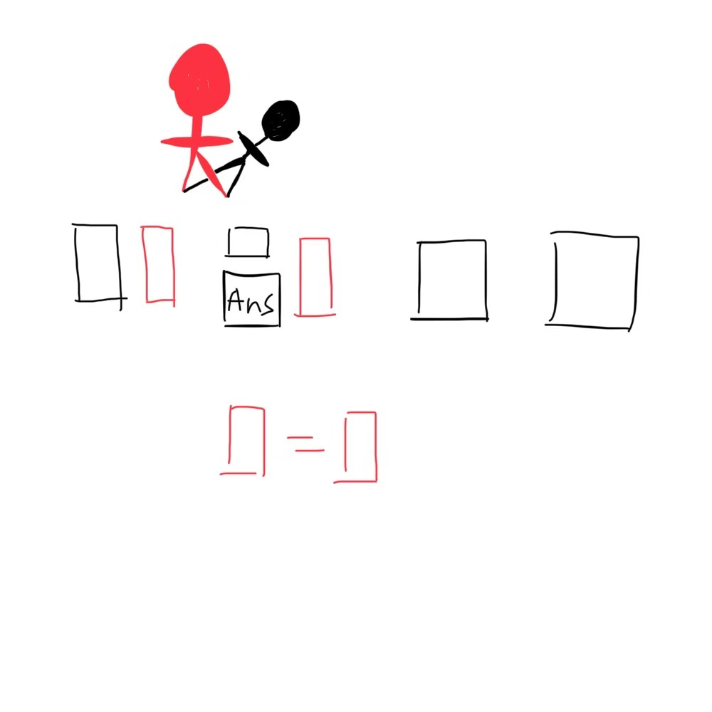

# 千字谜子题 254

## 题面

## 答案

`京`

## 解析

配了个图，形影不离形影相随什么都可以，开头是形影就行

## 本地附件

- [9877e5f0434d4913afe9e740c4a61587.webp](../../../assets/static.cipherpuzzles.com/static/images/9877e5f0434d4913afe9e740c4a61587.webp)

来源：[https://ccbc16.cipherpuzzles.com/data/c16-qian-puzzle.json#cid=254](https://ccbc16.cipherpuzzles.com/data/c16-qian-puzzle.json#cid=254)
