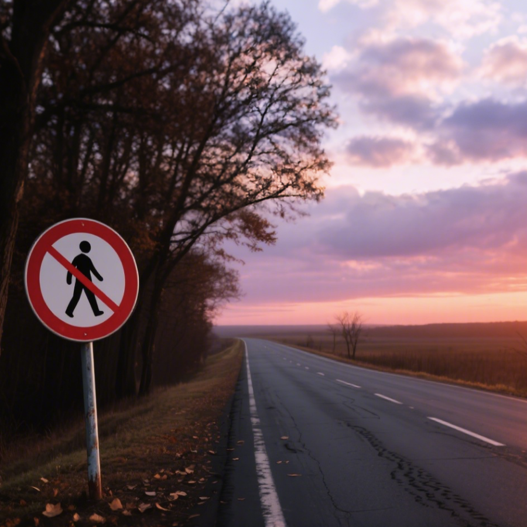

# 千字谜子题 255

## 题面

## 答案

`各`

## 解析

一条公路 左侧有一个禁止步行的标志→删除路左侧的足即为各

## 本地附件

- [14d65863b0ce45c4bd5ededc1d616696.webp](../../../assets/static.cipherpuzzles.com/static/images/14d65863b0ce45c4bd5ededc1d616696.webp)

来源：[https://ccbc16.cipherpuzzles.com/data/c16-qian-puzzle.json#cid=255](https://ccbc16.cipherpuzzles.com/data/c16-qian-puzzle.json#cid=255)
