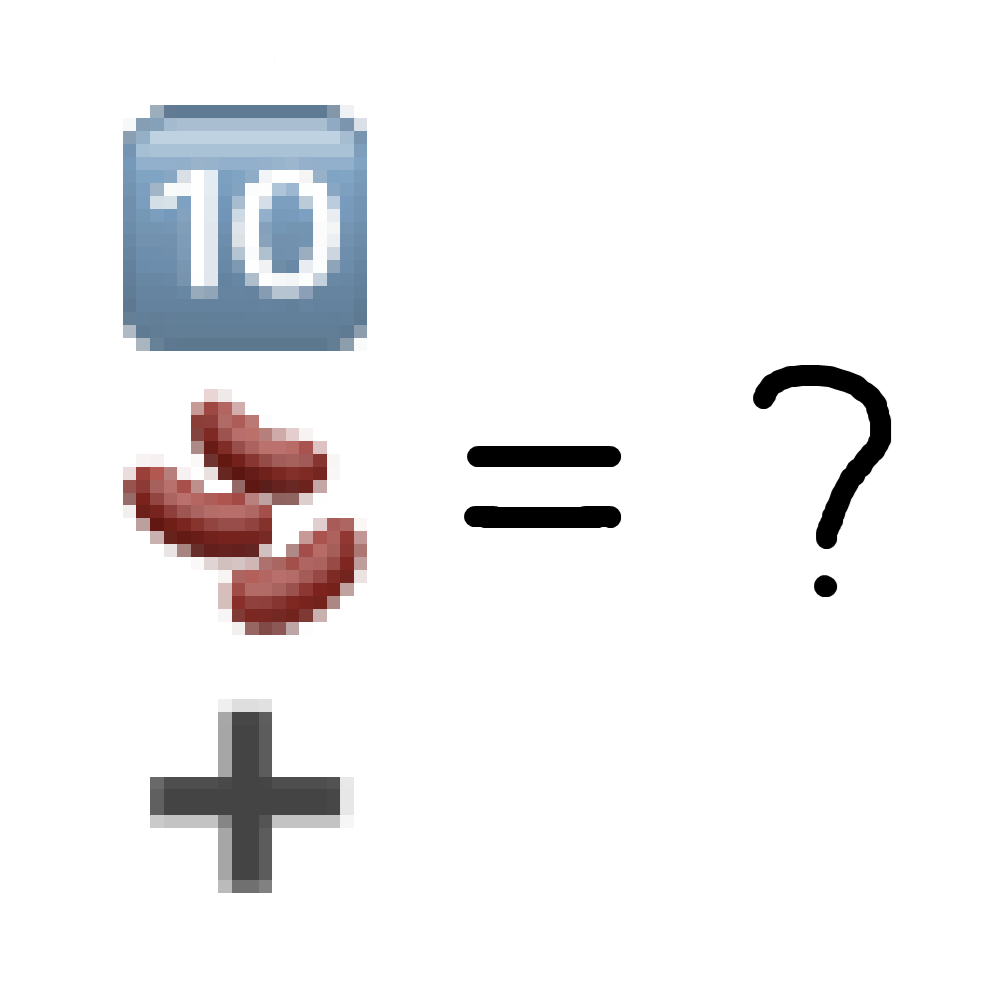

# 千字谜子题 256

## 题面

## 答案

`嘉`

## 解析

将emoji转为汉字“十”“豆”“加”，组合在一起得到答案“嘉”

## 本地附件

- [bfaf2a4f7d1042ce8dbfb98e14e9651d.webp](../../../assets/static.cipherpuzzles.com/static/images/bfaf2a4f7d1042ce8dbfb98e14e9651d.webp)

来源：[https://ccbc16.cipherpuzzles.com/data/c16-qian-puzzle.json#cid=256](https://ccbc16.cipherpuzzles.com/data/c16-qian-puzzle.json#cid=256)
