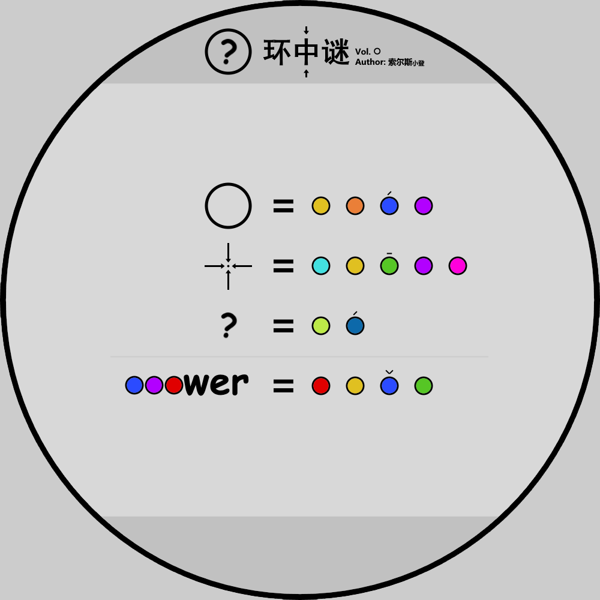

# 千字谜子题 258

## 题面

## 答案

`少`

## 解析

显然右侧为拼音。题面中素材几乎都是从标题里面直接扒下来的，可以猜测三个符号分别对应环中谜三个字——当然观察右边的拼音也可以发现前两个字的对应关系。得到 an?wer=?hao3，显然 ? 是 s。shao3 在新华字典里只有少一个字。

## 本地附件

- [9c8df8f253ae4619bf100e1e5496ceeb.webp](../../../assets/static.cipherpuzzles.com/static/images/9c8df8f253ae4619bf100e1e5496ceeb.webp)

来源：[https://ccbc16.cipherpuzzles.com/data/c16-qian-puzzle.json#cid=258](https://ccbc16.cipherpuzzles.com/data/c16-qian-puzzle.json#cid=258)
